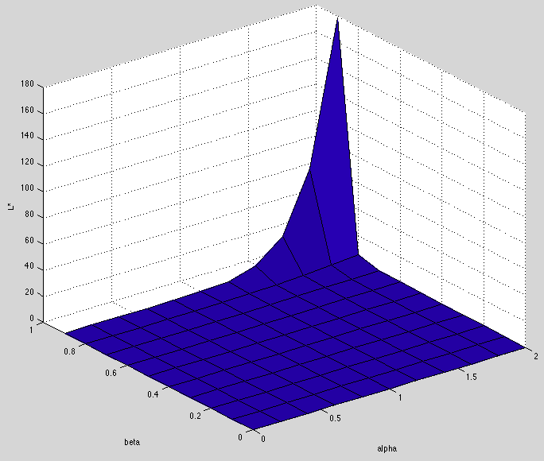

``` {r setup, echo = FALSE, message = FALSE, warning = FALSE}

knitr::opts_chunk$set(fig.width = 6, fig.height = 4, fig.path = 'Figs/',
                      echo = TRUE, message = FALSE, warning = FALSE)
library(tidyverse)
```

### Consider 

...the problem of a farmer who plants seeds using labor $L$ and grows a crop of
size $X$. Suppose the production function is

\begin{align*}
X = \alpha L
\end{align*}

and that the farmer’s utility is

\begin{align*}
U(X, L) = X^\beta + (\bar{L} - L)
\end{align*}

where $\bar{L} - L$ is leisure and $\beta < 1$. How many hours should the farmer put in and how does the
marginal productivity of labor effect the decision? 

* Marginal productivity of labor is $\alpha$, since one additional unit of labor $L$ will produce $\alpha$ additional units of crop.
* To optimize the labor, substitute the production function into the utility function and differentiate with respect to $L$, and set equal to zero:

\begin{align*}
  U(X, L)       &= X^\beta + (\bar{L} - L) = (\alpha L)^\beta + (\bar{L} - L)\\
  \frac{dU}{dL} &= \beta \alpha^\beta L^{\beta - 1} - 1 = 0\\
  L^*           &= \left(\frac{1}{\alpha^\beta \beta}\right)^\frac{1}{\beta-1}
\end{align*}
Since $\beta - 1$ is negative, turn it into $1 - \beta$ and flip the fraction:
\begin{align*}
  L^* = (\alpha^\beta \beta)^\frac{1}{1 - \beta}\\
\end{align*}

### Write a Matlab function 

...that plots the optimal labor supply against the marginal product of labor.

```
function [] = plotLstar(a_vec, b_vec)
%% Econ 241A lecture 1 assignment: 
% This function plots the optimal labor against a grid of alpha and beta
% values provided by the user.
% 
% The marginal product of labor is dX/dL = alpha.  Each additional unit
%   of labor increases output by alpha units.
%
% The optimal labor occurs when dU/dL = 0.  
%   U(L) = (alpha*L)^beta + (L_bar - L) = 0
%   L* = [1/(a^b * b)]^(1 / (b - 1)) = (a^b * b) ^ (1 / (1 - b))
% ------------
% Input: a_vec and b_vec are vectors of possible values for parameters
%   alpha > 0 and 0 < beta < 1.  These vectors will be used to create
%   a grid upon which to calculate L*.
% ------------
% Output: none; simply plots the function.

%% use meshgrid to create a matrix of alpha and beta from vectors
%    provided by the user.
    [a, b] = meshgrid(a_vec, b_vec)

%% Calculate L_star; note matrix operators
    L_star = ((a.^b) .* b) .^ (1 ./ (1 - b))

%% Plot using surfc
    surfc(a, b, L_star)
    zlabel('L*')
    xlabel('alpha')
    ylabel('beta')
end
```

-----

Calling this function with `a_vec = [0:.2:2]` and `b_vec = [0:.1:.9]` results in:



-----
