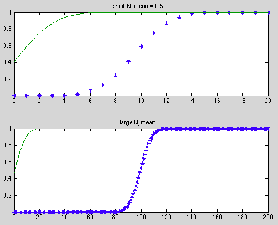
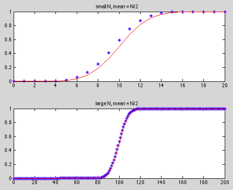
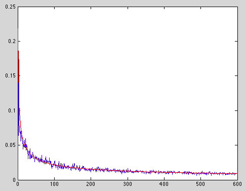
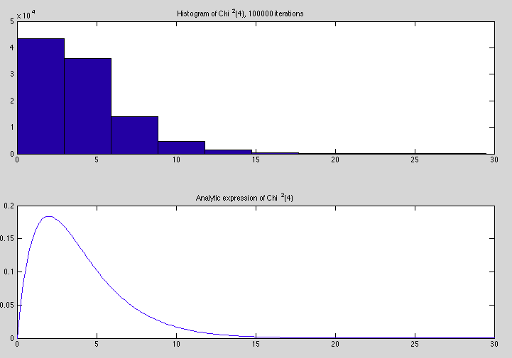
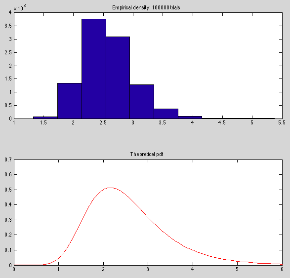

``` {r setup, echo = FALSE, message = FALSE, warning = FALSE}

knitr::opts_chunk$set(fig.width = 6, fig.height = 4, fig.path = 'Figs/',
                      echo = TRUE, message = FALSE, warning = FALSE)
library(tidyverse)
```

# Write a Matlab program...

...that plots two figures (one figure for small n and one for a large n), each comparing two cdfs. For both figures, one cdf is the number of heads out of n coin flips with a probability of heads equals to 1/2. The other cdf is for a normal distribution with  mean 1/2 and standard deviation sqrt(n/4). The Matlab function `binocdf` will give you the former and `normcdf` will give you the latter.

```
function [] = plot_bino_norm(n_small, n_large)
    x1 = 0:n_small
    x2 = 0:n_large

    bin_sm = binocdf(x1, n_small, 0.5)
    bin_lg = binocdf(x2, n_large, 0.5)

    norm_sm = normcdf(x1, 0.5, sqrt(n_small/4))
    norm_lg = normcdf(x2, 0.5, sqrt(n_large/4))

    figure;
    subplot(2,1,1);
    plot(x1, bin_sm, '*', x1,norm_sm);
    title('small N, mean = 0.5');
    subplot(2,1,2);
    plot(x2, bin_lg, '*', x2,norm_lg);
    title('large N, mean ');
end
```



### what if we plot with $x \sim N(n/2, \sqrt{n/4})$?



-----

# Suppose we draw $n$ independent random variables...

... $x_i \sim N(0,1)$ and generate the average $\bar{x}$ We know that $Pr(|\bar{x}/\sqrt{1/n}| > 1.96) = 0.05$.  Suppose we were to generate m such samples and count up the number of times that $|\bar{x}/\sqrt{1/n}| > 1.96$. Call this count divided by $m$, $\alpha$.
 
## What is the $\sigma$ of $\alpha$?

 The count for events exceeding the cutoff is a binomial 
 distribution, with $p = 0.05$ for success. 
 
$$\mathbb{E}[X] = mp$$ 

and 
     
$$var[X] = mp(1 - p)$$
     
 But $\alpha = count / m$, so:
     $\mu(\alpha) = p$ and 
     $\sigma = \sqrt{var[x]/m^2} = \sqrt{p(1-p)}/\sqrt{m}$
    
## Suppose...

... we wanted there to be a 90 percent chance that the estimated 
 alpha is between 0.04 and 0.06. How large must $m$ be? You may approximate 
 the distribution of alpha by the normal distribution.

 Determine sigma such that 90 of instances fall within +/-.01 of mean. $Z
 = -1.645$ for .05 below, $+1.645$ for .05 above so:
     $$1.645\sigma = .01 $$
     $$1.645 \times \sqrt{05 \times .95}/.01 = \sqrt{m} = 21.8$$
     $$m = 475$$

 
## Write a simulation program...

... that sets $n = 10$ and uses a variety of 
 values of $m$, some smaller than your value given in part (b) and some 
 larger. Then run this for a number of times saving alpha. Make a plot 
 that shows the theoretical standard
 deviation of alpha (from part (a)) as a function of m as well as the 
 empirical standard deviation of alpha from the simulations. Effectively, 
 do a Monte Carlo of doing a Monte Carlo.
 
```

function [sd_alpha] = monte_monte(M, N, Q, M_max)
% inputs: M = predicted number of trials from 2(b)
%         N = number of samples per trial
%         Q = number of trials per m value
%         M_max > M, upper limit for number of trials

    mean_a_m = zeros(M_max, 1);
    sd_a_m   = zeros(M_max, 1);

    m_vec = 1:M_max;

    for m = m_vec
        % Initialize alpha vector for this set of trials at M:
        alpha = zeros(Q, 1);

        for j = 1:Q
            % initialize x_bar vector for this set of Q trials:
            x_bar = zeros(m, 1);

            for i = 1:m
                % generate a vector length n, with random draws from N ~ (0, 1).
                x = randn(N, 1);
                % calculate the mean of vector.
                x_bar(i) = mean(x);
                % do this m times.
            end

            % determine which trials exceeded limits
            x_exceed = abs(x_bar./sqrt(1/N)) > 1.96;
                % booleans in Matlab are 0 (FALSE) and 1 (TRUE)

            % count how many trials!
            x_count = sum(x_exceed);
                % since TRUE == 1, sum == count of TRUEs

            % count how many means exceed bounds; assign to alpha (as count/m).
            alpha(j) = x_count/m;
        end

        % For this set of Q trials at this m, calc mean and sd, assign to 
        % appropriate spot in the mean and sd vectors
        mean_a_m(m) = mean(alpha);
        sd_a_m(m)   = std(alpha);
    end
end
```

run this using parameters: $M = 475; N = 10; Q = 30; M_{max} = 600$

```
%% plot theoretical sd for each m, and plot empirical sd for each m.
sd_empirical = monte_monte(475, 10, 30, 600)

sd_theo = sqrt(.05*(1-.05))./sqrt(m_vec);

plot(m_vec, sd_empirical, m_vec, sd_theo, 'r');
```



-----

# Write a Matlab program...

... that draws a simulated $\chi^2(4)$ density and  an analytic density on the same figure. To simulate the $\chi^2$ generate 4 standard normals (`randn(4,1)`), square them and add them up. Do this a  lot of times and then draw the histogram using the Matlab function `histogram`. Then draw the analytic expression using the `chi2pdf` function with 4 degrees of freedom. 

```
function [x] = sim_chi2(n, k)
%% simulates n instances of chi-squared at given k

    x = zeros(1, n);

    for i = 1:n
        chi2 = sum(randn(k, 1).^2);
        x(i) = chi2;
    end
end
```

```
n_sims = 100000
chi_vec = sim_chi2(n_sims, 4)

clear title xlabel ylabel

subplot(2, 1, 1);
hist(chi_vec);
title(sprintf('Histogram of Chi^2(4), %d iterations', n_sims))


an_expr = chi2pdf(0:.2:30, 4);
subplot(2, 1, 2);
plot(0:.2:30, an_expr);
title('Analytic expression of Chi^2(4)')
```




-----

# The pdf of the extreme value distribution...

... can be written:

$$f(x) = \frac{1}{\beta}e^{-\left(\frac{x-\mu}{\beta} + e^{-\frac{(x-\mu)}{\beta}}\right)}$$

where $mean(x) = \mu + \beta \gamma$, $\gamma \approx 0.5772$ and $median(x) = \mu - log(log(2))$.  
Generate a bunch of samples of standard normals each with 120 observations. Find the maximum value for each sample. Find the mean and median of the distribution of the maxima. Now solve for the values of $\mu$ and $\beta$ implied by the mean and median. Plot the empirical density (use the histogram function) of the maxima along with the theoretical pdf implied by the values of $\mu$ and $\beta$.

```
function [] = extreme_val_dist(n_trials, n_samples)
% compute extreme value distribution, for given number of trials and 
% samples.  Prints mu, gamma, and beta estimates, and plots empirical
% density and theoretical pdf.

    s_max = zeros(n_trials, 1);

    for i = 1:n_trials
        samples = randn(n_samples, 1);
        s_max(i) = max(samples);
    end

    s_max_mean = mean(s_max);
    s_max_med  = median(s_max);

    mu = s_max_med + log(log(2))
    gamma = .5772
    beta = (s_max_mean - mu) / gamma

    x = 0:.1:ceil(max(s_max));

    f_x = (1/beta).*exp(-((x-mu)/beta + exp(-(x-mu)/beta)));

    clear title xlabel ylabel

    subplot(2, 1, 1);
    hist(s_max);
    title(sprintf('Empirical density: %d trials', n_trials))
    subplot(2, 1, 2);
    plot(x, f_x, 'r')
    title('Theoretical pdf')
end
```

```
extreme_val_dist(100000)

mu =
    2.1596
gamma =
    0.5772
beta =
    0.7153
```


