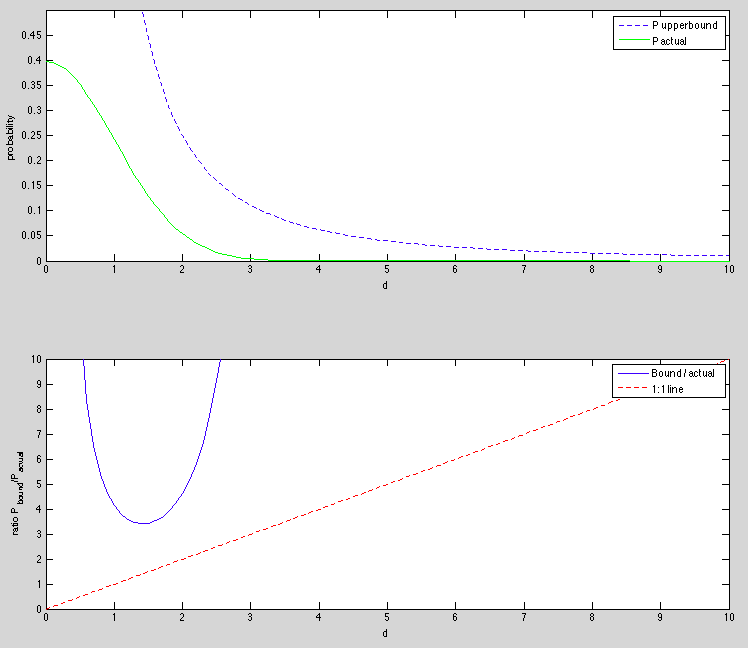

``` {r setup, echo = FALSE, message = FALSE, warning = FALSE}

knitr::opts_chunk$set(fig.width = 6, fig.height = 4, fig.path = 'Figs/',
                      echo = TRUE, message = FALSE, warning = FALSE)
library(tidyverse)
```

# Consider a Bernoulli random variable...

... with possible outcomes $x_1 = 10$, $x_2 = 80$, $p(X = x_1) =.4$. Consider the function $g(x) = \log{x}$.

## Find $g(\mathbb{E}[x])$ and $\mathbb{E}[g(x)]$

\begin{align*}
  \mathbb{E}[x] &= px_1 + (1 - p)x_2\\
    &= .4 \times 10 + .6 \times 80\\
    &= 4 + 48 = 52\\[12 pt]
  g(\mathbb{E}[x]) &= \log(52) \\
    & = 3.95\\[12 pt]
  \mathbb{E}[g(x)] &= \mathbb{E}[\log{x}]\\
    &= p \log{x_1} + (1 - p) \log{x_2}\\
    &= .4\log{10} + .6 \log{80}\\
    &= 3.55
\end{align*}

# One version of Chebychev’s inequality states...

... that if a distribution has $\mathbb{E}[x] = \mu$ and $var(x) = \sigma^2$ and $d \geq 0$, then

$$P(|x - \mu| \geq d) \leq \sigma^2/d^2$$

Consider $x \sim N(0, 1)$.

## Prove that the inequality holds...

... for $d = 1$, giving a proof that takes no more than five seconds.

* Let $\sigma = 1$ and $d = 1$, by hypothesis.  Recall that $P(anything) \leq 1$ since probability by definition is confined to [0, 1].
* Show that $P(|x - \mu| \geq d) \leq \sigma^2/d^2$. __Five second proof:__
    
\begin{align*}
  &\Longrightarrow \sigma^2/d^2 = 1                             &(\sigma^2/d^2 = 1^2/1^2)\\
  &\Longrightarrow P(|x - \mu| \geq d) \leq \sigma^2/d^2 = 1    &P(anything) \leq 1\\
  & & \blacksquare
\end{align*}

## Draw a graph in Matlab...

... that plots both the bound from Chebychev’s inequality and the actual value from the standard normal for interesting values of $d$.

### the plot:



### ... and the code:

```
function [] = chebychev_plot( d )
% Plots Chebychev bound and actual probability for "interesting values of
% d" (input) for a standard normal distribution function.
% Input d can be vector of values of d to be calculated/plotted.

mu = 0; sig2 = 1;

P_upperbound = sig2 ./ d.^2;

P_actual = normpdf(d, mu, sqrt(sig2));

subplot(2, 1, 1)
    plot(d, P_upperbound, 'b--', d, P_actual, 'g')
    ylim([0 max(P_actual + .1)])
    ylabel('probability'); xlabel('d')
    legend('P upperbound', 'P actual')
subplot(2, 1, 2)
    plot(d, P_upperbound./P_actual, d, d, 'r--')
    ylim([0 10])
    legend('Bound / actual', '1:1 line')
    ylabel('ratio P_{bound}/P_{actual}'); xlabel('d')

end
```

(called with `chebychev_plot(0:.1:10)`)
