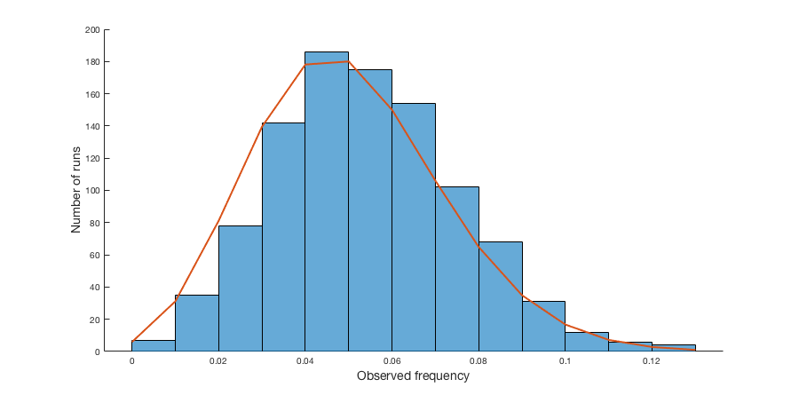

``` {r setup, echo = FALSE, message = FALSE, warning = FALSE}

knitr::opts_chunk$set(fig.width = 6, fig.height = 4, fig.path = 'Figs/',
                      echo = TRUE, message = FALSE, warning = FALSE)
library(tidyverse)

```

# Try the following problem: 

Draw $m$ iid standard normals, $x_i$, $i = 1, ..., m$.  Compute the statistic

$$T = \frac{1}{m} \sum_{i=1}^M I(x_i < \Phi^{-1}(.025) \cup x_i > \Phi^{-1}(.975))$$

Now repeat this experiment $n$ times and show the distribution of $T$. Do this for $m = 100$ and $n = 1000$. Show what you get empirically as well as what the theoretical answer should be. (Remember that the test statistic is essentially an average of Bernoulli trials.)



Code for `function [test_stat] = get_test_stat(m, n, pvals)`:

``` {r, eval = FALSE}
function [test_stat] = get_test_stat(m, n, pvals)
%% Generate frequencies
%  Inputs: m = number of trials per sample
%          n = number of samples
%          pvals = lower bound and upper bound between 0 and 1

    % Generate z values from p values
    z_bounds = icdf('Normal', pvals, 0, 1);

    % Generate m x n matrix of randoms from standard normal
    sample_m_n = randn(m, n);

    % Compare samples to z bounds; outside bounds = 1 (T), inside = 0 (F)
    test_m_n = (sample_m_n < z_bounds(1) | sample_m_n > z_bounds(2) );

    test_count = sum(test_m_n)

    test_stat = test_count ./ m;

end
```

Code for `function [x, pdf] = get_bino_pdf(test_stat, m, pvals)`:

``` {r, eval = FALSE}
function [x, pdf] = get_bino_pdf(test_stat, m, pvals)
%% Generate pdf
%  Since this is a set of Bernoulli trials, we can model it with a binomial
%  distribution...
%  Inputs: 
%    pvals = p value lower and upper bounds (this is used to
%      determine the overall p for the binomial distribution)
%    m = number of trials in each sample

    p = 1 - (pvals(2) - pvals(1))

    x = 0:max(test_stat) .* m; % note this is in counts, not count/m

    pdf = binopdf(x, m, p);

end
```

Code for function calls and plotting:

``` {r, eval = FALSE}
%% Set parameters

m = 100; n = 1000;
pvals = [.025, .975];

%%%%%%%%%%%%%%%%%%%%%%%%%%%%%%%%%%%%%%%%%%%%%%%%%%%%%%%%%%
%% Get test stats and binomial pdf based on these params
%%%%%%%%%%%%%%%%%%%%%%%%%%%%%%%%%%%%%%%%%%%%%%%%%%%%%%%%%%

test_stat = get_test_stat(m, n, pvals);

[x, pdf] = get_bino_pdf(test_stat, m, pvals);

%%%%%%%%%%%%%%%%%%%%%%%%%%%%%%%%%%%%%%%%%%%%%%%%%%%%%%%%%%
%% Plot histogram and pdf
%%%%%%%%%%%%%%%%%%%%%%%%%%%%%%%%%%%%%%%%%%%%%%%%%%%%%%%%%%

figure
hold on
    histogram(test_stat, 'BinWidth', 1/m);
    plot(x/m, pdf*n, 'linewidth', 2);
    xlabel('Observed frequency');
    ylabel('Number of runs');
hold off
    
```

-----

# Surveys in Nigeria:

My daughter is going to run a survey in Nigeria. 

* Enumerators are expensive, so each marginal response costs $c = 2500$ naira. 
    * 2500 naira $\approx$ \$7.02.
* A field experiment is planned. A baseline survey was run before any treatment, which indicated that the standard deviation of the variable of interest is $\sigma = 4$ and that the responses are approximately normally distributed. 
* My daughter believes the true effect size is $\mu = 2$. 
* Finding a positive estimated effect size will result in a publication which will have a NPV for her career equal to \$50,000. 
* (A reminder that sample means are roughly normally distributed.) 

How many surveys should my risk-neutral daughter buy?

## Outline the process

Net present value of publication, contingent on positive results, is $E(pub|pos.result) = \$50,000$ (and assuming $E(pub|neg.result) = 0$...); however, those positive results come at the cost of $c = \$7.02$ per survey.

$$E(pub) = E(pub|pos.result) \times P(pos.result) - c_{survey} \times n$$

So we'd like to get $P(pos.result)$ in terms of $n$; differentiate this with respect to $n$, set to zero, and solve for $n$.  Then check the second derivative to make sure we've found a maximum rather than a minimum, because that would be sad.

## Find $g(n) = P(pos.result)$

From previous slides, probability of rejecting the null (in the example for $|z| > 1.96$) is $F_z(-z) + (1 - F_z(z))$.

We also know that $F_z = \Phi(z - \mu/\sqrt{\sigma^2/n})$.  So:

\begin{align*}
  P(pos.result) &= \Phi(-z - 2/\sqrt{4^2/n}) + (1 - \Phi(z - 2/\sqrt{4^2/n}))\\
    &= \Phi(-z - \sqrt{n}/2) + (1 - \Phi(z - \sqrt{n}/2))
\end{align*}

## Putting it all together

Assuming a successful result based on a p-value of 0.05, then $z = \pm1.96$.

\begin{align*}
  \frac{d}{dn}[\$50000(\Phi(-1.96 - \sqrt{n}/2) + 
    (1 - \Phi(1.96 - \sqrt{n}/2))) - 7.02n] = 0\\
  \$50000\times[\phi(-1.96 - \sqrt{n}/2) + 
    (1 - \phi(1.96 - \sqrt{n}/2))](\frac{1}{4\sqrt{n}}) - 7.02 = 0
\end{align*}

Solving for $n$ will be ugly, so let's just calculate for $n$ from 1:200 and see where the slopes are equal.

``` {r compare_slopes}

z <- 1.96
naira_to_dollars <- 7.02 ### 2500 naira = $7.02

value_by_n <- data.frame(n = 1:200) %>%
  mutate(cn = n * naira_to_dollars,
         phi_lo = pnorm(-1.96 - (2 / (sqrt(16 / n)))),
         phi_hi = pnorm( 1.96 - (2 / (sqrt(16 / n)))),
         pub_value = 50000 * (phi_lo + 1 - phi_hi))

### add in derivative by taking diff of value at n and (n - 1)

value_by_n <- value_by_n %>%
  mutate(dval_dn = pub_value - lag(pub_value),
         dval_minus_c = abs(dval_dn - naira_to_dollars))

```

``` {r print dataframe}
DT::datatable(value_by_n %>%
                mutate(phi_lo = round(phi_lo, 5),
                       phi_hi = round(phi_hi, 5),
                       pub_value    = round(pub_value, 2),
                       dval_dn      = round(dval_dn, 3),
                       dval_minus_c = round(dval_minus_c, 5)))
```

Inspecting the dataframe we find an optimal value occuring around $n = 96$.

``` {r plot value vs n}

ggplot(value_by_n, aes(x = n, y = pub_value)) +
  theme_bw() +
  geom_line(color = 'blue4', size = 1.5, alpha = .7) + 
  geom_line(aes(y = cn), color = 'green4', size = 1.5, alpha = .7) + 
  labs(x = 'Number of surveys',
       y = 'Value (dollars)',
       title = 'Surveys vs. expected value and cost')
```

``` {r zoom in on derivative}

ggplot(value_by_n, aes(x = n, y = dval_dn)) +
  theme_bw() +
  geom_line(color = 'blue4', size = 1.5, alpha = .7) + 
  geom_hline(aes(yintercept = naira_to_dollars), color = 'green4', size = 1.5, alpha = .7) +
  geom_vline(xintercept = 96, color = 'red4', alpha = .7) +
  xlim(c(90, 105)) + ylim(c(0, 10)) + 
  labs(x = 'Number of surveys',
       y = 'Marginal value (dollars per survey)',
       title = 'Surveys vs. marginal value and marginal cost')

```

