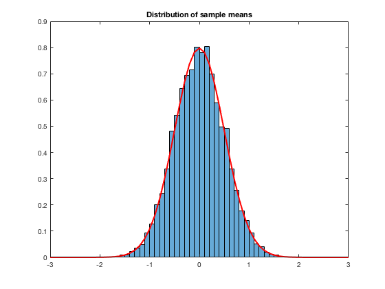
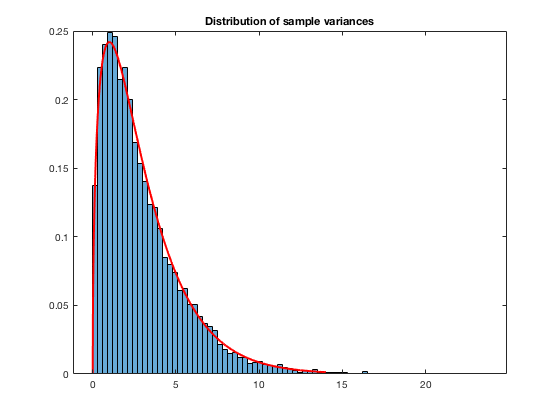
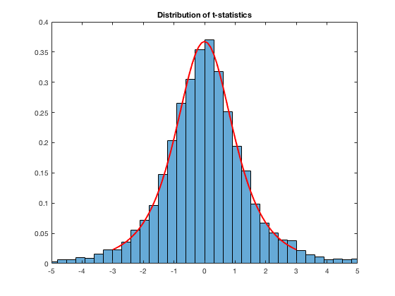
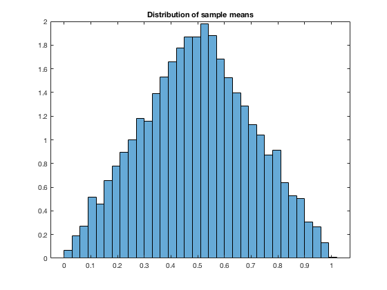
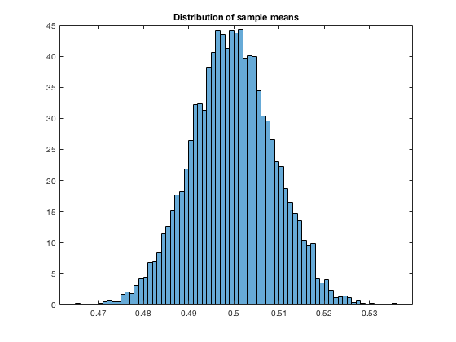

# Generate $n = 4$ standard normals...

... compute the sample mean $\bar{x}$, sample variance $s^2$, and the $t$-statistic given by $t = \bar{x}/\sqrt{s^2/n}$.  Do this a lot of times, saving the result. (While you’re at it, use tic/toc to compute how long your simulation takes.) Now make three plots showing the empirical and theoretical pdfs, one for the sample mean, one for $(n-1)$ times the sample variance, and one for the $t$-statistic.

``` {r, eval = FALSE}

function [] = lotsa_plots(n, m)
%%%%%%%%%%%%%%%%%%%%%
%%% calculations! %%%
%%%%%%%%%%%%%%%%%%%%%

    tic;

    % n = 4; m = 1000;

    % generate matrix of values - lots of columns, n = 4 rows
    x_m_by_n = normrnd(0,1,n,m); % n rows x m columns

    % generate mean, variance, and t stat for each column
    x_bar = mean(x_m_by_n);
    var_x = var(x_m_by_n);
    t_stat_x = x_bar ./ sqrt(var_x / n);

    toc % print time to calculate

%%%%%%%%%%%%%%
%%% plots! %%%
%%%%%%%%%%%%%%

    % set up plot of sample means
    x_vals_norm = -3:0.1:3;

    x_bar_pdf = normpdf(x_vals_norm,0,1/sqrt(n)); %theoretical pdf

    figure
        histogram(x_bar, 'Normalization', 'pdf')
        hold on; 
        plot(x_vals_norm, x_bar_pdf, 'r', 'lineWidth', 2)
    title('Distribution of sample means')

    % set up plot of sample variances (chi-squared!)
    x_vals_chi2 = 0:0.01:14;

    var_x_pdf = chi2pdf(x_vals_chi2, n - 1); % 4 samples = 3 degrees of freedom

    figure
        histogram((n - 1) .* var_x, 'Normalization', 'pdf')
        hold on; 
        plot(x_vals_chi2, var_x_pdf, 'r', 'lineWidth', 2)
        title('Distribution of sample variances')

    t_stat_pdf = tpdf(x_vals_norm, (n - 1));

    figure
        histogram(t_stat_x, 'Normalization', 'pdf')
        hold on;
        plot(x_vals_norm, t_stat_pdf, 'r', 'lineWidth', 2)
        title('Distribution of t-statistics')
        xlim([-5 5])

    toc % time to calculate AND plot
end

```

Called with: `lotsa_plots(4, 10000)`







# Draw a sample of size $n = 2$...

... of uniform(0,1) independent random variables and compute the sample mean. Do this a lot of times and save the sample means. Plot the empirical distribution. Now do it again with $n =  1,000$. Does either distribution look familiar?

``` {r, eval = FALSE} 

function [] = unif_mean_dist(n, m)
%%%%%%%%%%%%%%%%%%%%%
%%% calculations! %%%
%%%%%%%%%%%%%%%%%%%%%
    % n = 2; m = 1000;

    % generate matrix of values - lots of columns, n = 4 rows
    x_m_by_n = rand(n,m); % n rows by m columns

    % generate mean for each column
    x_bar = mean(x_m_by_n);
    
    % set up plot of sample means
    figure
        histogram(x_bar, 'Normalization', 'pdf')
    title('Distribution of sample means')
end

```

Called with `unif_mean_dist(2, 10000)`:



Called with `unif_mean_dist(1000, 10000)`:

