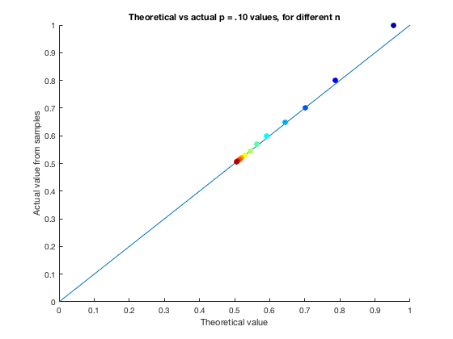

``` {r setup, echo = FALSE, message = FALSE, warning = FALSE}

knitr::opts_chunk$set(fig.width = 6, fig.height = 4, fig.path = 'Figs/',
                      echo = TRUE, message = FALSE, warning = FALSE)
library(tidyverse)
```

## The mean, $\bar{x}$, of $n$ Bernoulli trials...

... with $p = 1/2$ is distributed approximately $\bar{x}^A \sim N \left( p, \frac{p(1-p)}{n} \right)$. That suggests that 10 percent of the time the mean should turn out to be greater than $p + 1.2816 \times \sqrt{p(1 − p)/n}$. Run a series of Monte Carlo simulations to find out how good an approximation this is for a variety of values of $n$.

### The function:

``` {r, eval = FALSE}
function [p_10, p_10_th, m_mean] = ninety_pctile(p, n_vec, samples)
% This function calculates the 90th percentile (p = .10, one-tailed) for
% mean of a set of Bernoulli trials and compares to the 
% theoretical p = .10 cutoff value of z = 1.286 for a normal distribution.
% Inputs: 
%   p       = probability of success in Bernoulli trials
%   n_vec   = vector of n values in each sample
%   samples = number of samples 
% Outputs (all vectors with rows to match up with n_vec values):
%   p_10    = 90th percentile of sample means (10% above this)
%   p_10_th = theoretical one-tailed P value of .10
%   m_mean  = matrix of sample means for each n_vec value

% Initialize output vectors
    m_mean  = zeros(length(n_vec), samples);
    p_10    = zeros(length(n_vec), 1);
    p_10_th = zeros(length(n_vec), 1);

% since n differs for each set of samples, can't do 3d matrix
    for i = 1:length(n_vec)
        n = n_vec(i);
        
        % create matrix of uniform random values, n rows and many columns
        mat = rand(n, samples);
        
        % create matrix of successes from matrix of unif rand vals
        m_success = mat < p;
        
        % calculate mean of each sample, and assign to output matrix
        m_mean_tmp   = mean(m_success);
        m_mean(i, :) = m_mean_tmp;
        
        % calculate actual and theoretical 90th percentile values
        p_10(i)      = quantile(m_mean_tmp, .90);
        p_10_th(i)   = p + 1.2816 * sqrt(p * (1 - p) / n);
    end
end
```

### The code that calls the function:

``` {r eval = FALSE}
p = .5;

n_vec = [2, 5, 10, 20, 50, 100, 200, 500, 1000, 2000, 5000, 10000];

samples = 1000;

[p_10, p_10_th, m_mean] = ninety_pctile(p, n_vec, samples);

figure
hold on;
refline(1, 0);
cmap = jet(length(n_vec)); % color map for n values
scatter(p_10_th, p_10, 50, cmap, 'filled')

xlabel('Theoretical value')
ylabel('Actual value from samples')
title('Theoretical vs actual p = .10 values, for different n')

csvwrite('p_vals.csv', cat(2, n_vec', p_10_th, p_10))
csvwrite('m_means.csv', cat(2, n_vec', m_mean))
```



### More figures

``` {r}
library(tidyverse)

p_10 <- read_csv('p_vals.csv', col_names = FALSE) %>%
  setNames(c('n', 'p_theo', 'p_actual')) %>%
  mutate(n_labs = factor(as.character(n), levels = as.character(n)))

matlab_plot <- ggplot(p_10, aes(x = p_theo, y = p_actual, color = n_labs)) +
  theme_bw() + theme(panel.border = element_blank()) +
  geom_abline(aes(slope = 1, intercept = 0), 
              color = 'red', alpha = .5, 
              size = .25) +
  geom_point(size = 2) +
  labs(title = 'Theoretical vs actual p = .10 values, for different n',
       x = 'Theoretical value',
       y = 'Actual value from samples',
       color = 'n') +
  xlim(0, 1) + ylim(0, 1)

# plotly::ggplotly(matlab_plot)
print(matlab_plot)
```

``` {r, fig.height = 6}

m_means <- read_csv('m_means.csv', col_names = FALSE)
names(m_means)[1] <- 'n'

m_means <- m_means %>%
  gather(x, mean_val, -n)

ggplot(m_means, aes(x = mean_val)) +
  theme_bw() + theme(panel.border = element_blank()) +
  geom_histogram(bins = 20) +
  facet_wrap( ~ n, ncol = 3, scales = 'free') +
  labs(title = 'Histograms for different n values',
       x = 'Sample means',
       y = 'frequency')
```

## Suppose $x \sim U(0, u)$. 

Consider the function $g(\theta) = \log{\theta}$. It turns out that the first-order Taylor series approximation to the variance of a function of a random variable is

$$\left[  \frac{dg(\theta)}{d\theta}_{|E[\theta]} \right]^2 Var(\theta)$$

Use this expression to calculate and approximate variance of $\log{\theta}$ for $u = 1$ and for $u = .01$. Now redo the calculation by generating simulated $\theta$ and finding the variance of $log{\theta}$.

\begin{align*}
  \text{Var}(g(\theta)) &= \left[  \frac{dg(\theta)}{d\theta}_{|E[\theta]} \right]^2 
      \text{Var}(\theta)\\
    &= \left[ \frac{d\log{\theta}}{d\theta}_{|E[\theta]} \right]^2 
      \text{Var}(\theta)\\
    &= \left[ \frac{1}{\theta}_{|E[\theta]} \right]^2 
      \text{Var}(\theta)\\
    &= \frac{ \text{Var}(\theta)}{E[\theta]^2}\\
  \text{Var}(\theta) &= (b - a)^2 / 12\\
  \text{E}(\theta) &= (b + a) / 2\\
  \Rightarrow \text{Var}(g(\theta)) &= \left( \frac{2}{b + a} \right)^2 \frac{(b - a)^2}{12}\\
    &= \frac{(b - a)^2}{3(b + a)^2}\\
\end{align*}

Since $a = 0$ and $b = u \in 1, .01$, this simplifies to $u^2 / 3 u^2$, or simply $1/3$.

### Code to calculate from samples

``` {r, eval = FALSE}
function[var_log] = calc_var_log(u, n)
% Draws n samples from uniform distribution U(0, u), applies a log
% function, and returns the variance calculated from these
% samples.

    % n = 1000;
    
    theta = rand(n, 1) * (u); 
      % rescale random values from 0 to u

    logtheta = log(theta);

    mean_theta = mean(theta);
    var_theta  = var(theta);
    
    mean_log = mean(logtheta);
    var_log  = var(logtheta);
    
end
```
