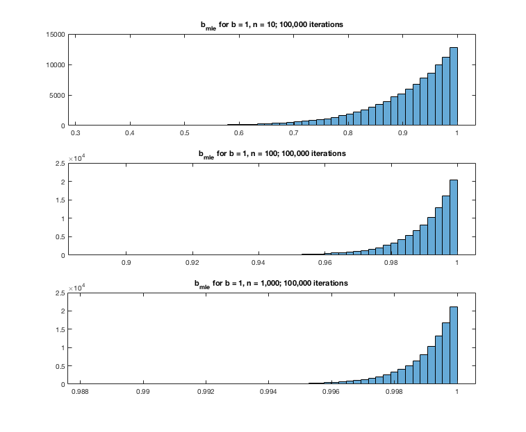

``` {r setup, echo = FALSE, message = FALSE, warning = FALSE}

knitr::opts_chunk$set(fig.width = 6, fig.height = 4, fig.path = 'Figs/',
                      echo = TRUE, message = FALSE, warning = FALSE)
library(tidyverse)
```

### Suppose $x_i \sim  iid \hspace{5pt} U[0, b]$.  

Write the joint pdf for $x$, being careful about edge conditions. Find the value of $b$ that maximizes the joint probability. (Hint: this is a logic question rather than a calculation question.)

Since $x_i$ are independent, and $x_i \sim U[0, b]$ for all $i$, and $b > 0$:
\begin{align*}
  f(x_i) &= \frac{1}{b} \hspace{10pt} \forall i\\
  \Rightarrow f(x) &= \prod_{i=1}^n \frac{1}{b}\\
    &= \frac{1}{b^n}
\end{align*}

``` {r, echo = FALSE}

x_i <- data.frame(x = runif(10), y = 0)

df <- data.frame(x = seq(.5, 2, .01)) %>%
  mutate(y = 1/x,
         above = (x > max(x_i$x)))

ggplot(df, aes(x, y)) +
  theme_bw() + 
    theme(panel.border = element_blank(), 
          axis.text = element_blank(), 
          axis.ticks = element_blank(),
          axis.title.y = element_text(angle = 0)) +
  geom_vline(xintercept = 0, color = 'grey20') +
  geom_hline(yintercept = 0, color = 'grey20') +
  geom_point(data = x_i, aes(x, y), color = 'red', size = 2) +
  geom_line(aes(group = above, color = above), size = 2, show.legend = FALSE) +
  geom_vline(xintercept = max(x_i$x), color = 'red') +
  geom_vline(xintercept = 1, color = 'green', linetype = 'dashed') +
  scale_color_manual(values = c('grey50', 'blue')) +
  xlab('b') + ylab(bquote(frac('1', b^n)))

```

To maximize this, make $b$ as small as possible.  However, if we observe a sample $x$, then we know $b$ cannot be lower than the maximum value in $x$.  So:

$$\hat{b} = max(x_i)$$
  
While this is the best estimator we can come up with based on our sample, we know that the true value of $b$ will be higher than this.

### Suppose $\bar{x}|\theta \sim N(\theta, \frac{\sigma^2}{n})$.

Assume $\sigma^2$ and $n$ are known constants and $\theta \sim U(-c, c)$. Find an expression for

$$f(\bar{x}) = \int_{-\infty}^{\infty} f(\bar{x}|\theta)f(\theta)d\theta$$

-----

\begin{align*}
  \bar{x}|\theta &\sim N(\theta, \frac{\sigma^2}{n})\\
    &\Rightarrow f(\bar{x}|\theta) = \frac{1}{\sqrt{2\pi\sigma^2/n}}e^{-\frac{(\bar{x} - \theta)^2}{2\sigma^2/n}}\\
  \theta &\sim U(-c, c)\\
    &\Rightarrow f(\theta) = \frac{1}{2c} &\text{ for } \theta\in(-c,c), 0 \text{ else}\\
  f(\bar{x}) &= \int_{-\infty}^{\infty} f(\bar{x}|\theta)f(\theta)d\theta\\
    &= \int_{-c}^{c} \frac{1}{\sqrt{2\pi\sigma^2/n}}e^{-\frac{(\bar{x} - \theta)^2}{2\sigma^2/n}} \frac{1}{2c} d\theta\\
    &= \frac{1}{2c} \int_{-c}^{c} \frac{1}{\sqrt{2\pi\sigma^2/n}}e^{-\frac{(\bar{x} - \theta)^2}{2\sigma^2/n}}  d\theta\\
    &= \frac{1}{2c} \left[\Phi \left(\frac{c - \bar{x}}{\sqrt{\sigma^2/n}}\right) - \Phi \left(\frac{-c - \bar{x}}{\sqrt{\sigma^2/n}}\right)\right]
\end{align*}

### Returning to question 1

Generate $n = \{10, 100\} \hspace{5pt} iid \hspace{5pt} U(0, b = 1)$ random variables and find the maximum likelihood estimator of $b$. Do this many times for each sample size and report on the distribution of $b_{mle}$.  In particular, is it unbiased?

``` {r, eval = FALSE}
function [b_mle] = estimate_b(b, n, m)
%  This function calculates a maximum likelihood estimator based on a
%  sample of n observations from a uniform distribution from 0 to b.
%  Arguments: 
%    b: top end of random uniform distribution
%    n: number of observations in the sample
%    m: the number of iterations for this sample size
%  Return value: 
%    b_mle: vector of the max likelihood estimator for b for each sample

    % generate n rows x m columns of random uniform ~U[0, 1], multiply 
    % by b to get ~U[0, b]
    x = rand(n, m) * b;

    % from question 1, our b_mle is just the max observed value of x
    b_mle = max(x);
end
```

``` {r, eval = FALSE}
b = 1;

b_mle10   = estimate_b(1,   10, 100000);
b_mle100  = estimate_b(1,  100, 100000);
b_mle1000 = estimate_b(1, 1000, 100000);

subplot(3, 1, 1)
histogram(b_mle10, 50)
title('b_{mle} for b = 1, n = 10; 100,000 iterations')

subplot(3, 1, 2)
histogram(b_mle100, 50)
title('b_{mle} for b = 1, n = 100; 100,000 iterations')

subplot(3, 1, 3)
histogram(b_mle1000, 50)
title('b_{mle} for b = 1, n = 1,000; 100,000 iterations')
```



This is clearly a biased estimator, since the expected value of the estimator will always be less than the actual parameter value.
