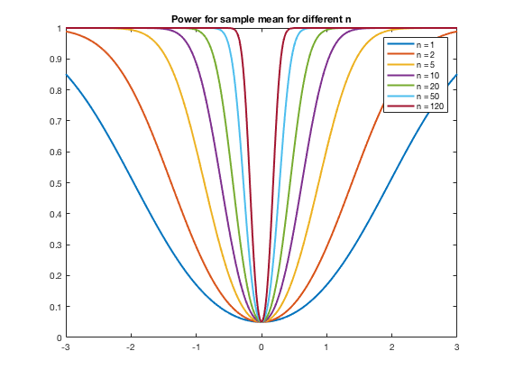

``` {r setup, echo = FALSE, message = FALSE, warning = FALSE}

knitr::opts_chunk$set(fig.width = 6, fig.height = 4, fig.path = 'Figs/',
                      echo = TRUE, message = FALSE, warning = FALSE)
library(tidyverse)
```

## Assignment 15 {.tabset}

### Problem 1

Write a program that computes the power function for our standard mean of iid normal variables, assuming the null hypothesis is $\mu_0 = 0$ and that $\sigma^2 = 1$, that the sample is size $n$, and we do a 5 percent test.  (Do not use the Matlab function sampsizepwr; it makes it too easy.) So we need to compute

$$\beta(\mu) = P\left( |z > 1.96| \biggr| z \sim N(\mu, \frac{\sigma^2}{n})\right)$$

Along the way we will need to determine the $\bar{x}$ at our desired $z$ values in order to calculate power as a function of $\mu$ and $n$:

\begin{align*}
    z &= \frac{\bar{x} - \mu_0}{\sqrt{\sigma^2/n}} &\text{(standardize)}\\
    \bar{x} &= \mu_0 + z \times \sqrt{\sigma^2/n} &\text{(rearrange)}\\
    \bar{x} &= (\pm 1.96) / \sqrt{n} &\text{(given $\mu_0 = 0, \sigma^2 = 1$)}
\end{align*}

Then from this we can find power:

\begin{align*}
  Power &= P(|\bar{x}| > 1.96 / \sqrt{n} | \mu, n)\\
    &= 1 - P(\frac{-1.96}{\sqrt{n}} < \bar{x} < \frac{1.96}{\sqrt{n}})\\
    &= 1 - (P(Z < \frac{1.96 - \mu}{\sqrt{\sigma^2 / n}}) - P(Z < \frac{-1.96 - \mu}{\sqrt{\sigma^2 / n}})
\end{align*}

``` {r, eval = FALSE}
function [beta] = beta_n(n, mu)
% Calculates beta (power of test) as function of n and true mu,
% against a std normal with mu_0 = 0, assuming sigma^2 = 1.
% Inputs: 
%   n    = vector of sample sizes
%   mu   = estimated population mean
% Outputs: 
%   beta = power of test, as 1 - prob of type II error; this
%          will be a vector of same length as n

    % set up parameters
    mu_0 = 0; sig2 = 1; z_target = 1.96;
    
    % Calculate standardized z score for each value of n
    x_bar = mu_0 + z_target .* sqrt(sig2 ./ n);
    
    z_b_pos = ( x_bar - mu) ./ sqrt(sig2 ./ n);
    z_b_neg = (-x_bar - mu) ./ sqrt(sig2 ./ n);
    % Calculate beta for each z score (each tail)
    beta = 1 - (normcdf(z_b_pos, 0, sig2) - normcdf(z_b_neg, 0, sig2));

end
```

Graph the power function for $n = 20$ and $n = 120$. 

``` {r, eval = FALSE}
function [] = powerplot(n)
% Iterates over each sample size in n, and generates a plot of power at
% different z values from 0 to 2
% Inputs: n = vector of different n values to plot
% Output: none

    % Set up vector of values for x axis, and an empty pwr array
    x_vals = -3:.02:3;

    pwr = zeros(length(x_vals), length(n));

    % For each x value, calc power at all given n values (since power_n
    % function can accept multiple n values, we can calc all at once)
    for i = 1:length(x_vals)
        pwr(i, :) = beta_n(n, x_vals(i));
    end
    
    % Plot the array of powers at each n against the x values
    plot(x_vals, pwr, 'linewidth', 2)
    legend(cellstr(num2str(n', 'n = %-d')))
    title('Power for sample mean for different n')

end

% Function call to generate plot: 
powerplot([1 2 5 10 20 50 120])

```



Suppose you "accept" the null with 20 observations. Is it convincing that the true $\mu \neq 1$? How about $\mu \neq .25$? What would your answer be for 120 observations?

``` {r, eval = FALSE}
beta_n([20 120],   1)

beta_n([20 120], .25)
```

|  n  | $\mu \neq 1$ | $\mu \neq .25$ |
| --- | ------------ | -------------- |
|  20 |     .994     |     0.2009     |
| 120 |    1.000     |     0.7819     |

If the true unknown population mean is $\mu = 1$, and we have either 20 or 120 observations, we have almost no chance of incorrectly accepting the null hypothesis $H_0: \mu_0 = 0$ in favor of the alternative hypothesis $H_a: \mu_0 \neq 0$.

For a true mean $\mu = .25$, since the mean is closer to the null, it is harder to distinguish the true mean from the null; for $n = 20$ and $n = 120$, we have about a 80% and 22% chance respectively of incorrectly accepting the null.

### Problem 2

Suppose $x_i \sim iid(\mu, \sigma^2), i = 1, ..., n$ with $\sigma^2$ known.  Show that the Wald, likelihood ratio, and Lagrange multiplier tests of

$$H_0: \mu = \mu_0 \\ H_a: \mu \neq \mu_0$$

are all identical, where

$$W = \frac{(\hat\mu_{mle} - \mu_0)^2}{I(\hat\mu_{mle})^{-1}}$$

$$LR = -2(\mathcal{L}^*(\mu_0) - \mathcal{L}(\hat\mu_{mle}))$$

$$LM = \frac{\partial \mathcal{L}(\mu)}{\partial\mu}\biggr|_{\mu_0}' [I(\mu_0)]^{-1} \frac{\partial \mathcal{L}(\mu)}{\partial\mu}\biggr|_{\mu_0}$$

Assuming this is asking about a normal distribution:  

$$f(x|\mu, \sigma^2) = \frac{1}{\sqrt{2 \pi \sigma^2}} \exp -\frac{(x - \mu)^2}{2\sigma^2}$$ 

-----

Start with the likelihood ratio and crunch it into manageable form:

\begin{align*}
  L(\mu, \sigma^2 | x) &= \prod_{i=1}^n f(x_i | \mu, \sigma^2)\\
    &= \left(\frac{1}{\sqrt{2 \pi \sigma^2}}\right)^n 
      \prod_{i=1}^n e^{-\frac{(x_i - \mu)^2}{2\sigma^2}}\\[6pt]
  \mathcal{L}(\mu, \sigma^2 | x) &= \ln L = -\frac{n}{2} \ln (2\pi\sigma^2) - 
    \sum_{i = 1}^n \frac{(x_i - \mu)^2}{2\sigma^2}\\[6pt]
  LR &= -2(\mathcal{L}^*(\mu_0) - \mathcal{L}(\hat{\mu}_{MLE}))\\
    &= 2(\mathcal{L}(\hat{\mu}_{MLE}) - \mathcal{L}^*(\mu_0))\\
    &= 2\left[\left(-\frac{n}{2} \ln (2\pi\sigma^2) - 
      \sum_{i = 1}^n \frac{(x_i - \bar{X})^2}{2\sigma^2}\right) -
      \left(-\frac{n}{2} \ln (2\pi\sigma^2) - 
      \sum_{i = 1}^n \frac{(x_i - \mu_0)^2}{2\sigma^2}\right)\right]\\
    &= \frac{1}{\sigma^2} \left(-\sum_{i = 1}^n (x_i - \bar{X})^2 + 
      \sum_{i = 1}^n (x_i - \mu_0)^2\right)\\
    &= \frac{1}{\sigma^2} \left(-\sum_{i = 1}^n \bar{X}^2 + \sum_{i = 1}^n\mu_0^2 + 
      2\bar{X}\sum_{i = 1}^n x_i \times \frac{n}{n} - 
      2\mu_0 \sum_{i = 1}^n x_i \times \frac{n}{n} \right)\\
    &= \frac{1}{\sigma^2} \left(n\mu_0^2 - n\bar{X}^2 +
      2n\bar{X}^2 - 2n\mu_0 \bar{X} \right)\\
    &= \frac{n}{\sigma^2} \left(\bar{X}^2 - 2\mu_0 \bar{X}  + \mu_0^2 \right)\\
  \Rightarrow LR &= \frac{n}{\sigma^2} (\bar{X} - \mu_0)^2\\
\end{align*}

Next examine the Wald test:
\begin{align*}
  W &= \frac{(\hat\mu_{mle} - \mu_0)^2}{I(\hat\mu_{mle})^{-1}}\\
    &= \frac{(\bar{X} - \mu_0)^2}{I(\bar{X})^{-1}}\\[12pt]
    \text{From math camp, }I(\theta) &= n\mathbb{E} \left[\left(
      \frac{\partial}{\partial \theta} \ln f(X_i|\theta) \right)^2\right]\\
      &= -n \mathbb{E} \left[
        \frac{\partial^2}{\partial^2 \theta} \ln f(X_i|\theta) \right] \text{under certain regularity conditions}\\
      &= -n \mathbb{E} \left[
        \frac{\partial^2}{\partial^2 \mu} 
          \left(-\frac{1}{2}\ln (2\pi\sigma^2) - \frac{(x - \mu)^2}{2 \sigma^2} \right) \right]\\
      &= -n \mathbb{E} \left[\frac{\partial}{\partial \mu} 
          \left(0 - -2\frac{x - \mu}{2 \sigma^2} \right) \right]\\
      &= -n \mathbb{E} \left[\frac{-1}{\sigma^2}\right]\\
      &= \frac{n}{\sigma^2}\\[12pt]
  \Rightarrow W &= \frac{n}{\sigma^2}(\bar{X} - \mu_0)^2
\end{align*}
  
Finally examine the Lagrangian multiplier test:

\begin{align*}
  LM &= \frac{\partial \mathcal{L}(\mu)}{\partial\mu}\biggr|_{\mu_0}' 
    [I(\mu_0)]^{-1} 
    \frac{\partial \mathcal{L}(\mu)}{\partial\mu}\biggr|_{\mu_0}\\[6pt]
  \frac{\partial \mathcal{L}(\mu)}{\partial\mu}\biggr|_{\mu_0} &= 
      0 + \frac{1}{\sigma^2}\sum_{i=1}^n (x_i - \mu)\biggr|_{\mu_0}\\
    &= \frac{1}{\sigma^2} \sum_{i=1}^n x_i \times \frac{n}{n} - n\mu_0\\
    &= \frac{n}{\sigma^2} (\bar{X} - \mu_0)\\[6pt]
    \Rightarrow LM &= \frac{n}{\sigma^2} (\bar{X} - \mu_0)' 
      [I(\mu_0)]^{-1} 
      \frac{n}{\sigma^2} (\bar{X} - \mu_0)\\
    \text{From above, }I(\mu)  &= \frac{n}{\sigma^2}\\
    \Rightarrow LM &= \frac{n}{\sigma^2}(\bar{X} - \mu_0)^2
\end{align*}

For an iid normally distributed random sample with known $\sigma^2$, all three tests can be represented as 

$$ LR = Wald = LM = \frac{n}{\sigma^2}(\bar{X} - \mu_0)^2 \hspace{12pt} \blacksquare$$

### Problem 3

Income is distributed (very) roughly log-normal once people with zero income are dropped from the sample. The file `cpsMarch2016Income.mat` contains wage and salary income from the March 2016 current population survey in the variable `wsal_val` and gender in the variable `fe` (`fe` = 1 for women and `fe` = 0 for men.)

You may "remember" (or may have looked it up), that the pdf of a log normal can be written

$$f(y|\mu, \sigma^2) = \frac{1}{y\sigma\sqrt{2\pi}}\exp \left\{-\frac{(\log y - \mu)^2}{2\sigma^2}\right\}$$

And that the mean is $\exp [\mu + \sigma^2]$, while the variance is $[\exp (\sigma^2) - 1] \exp(2\mu + \sigma^2)$.

We are interested in the hypothesis that the variance of the level of income is equal for men and women.

* Find the maximum likelihood values of $\mu$ and $\sigma^2$ and the variance separately for women and for men and then estimated jointly.

``` {r, eval = FALSE}
clear all;

load('cpsMarch2016Income.mat')

%% Combine data into matrices; censor zeros and then create a log version
inc_raw = [wsal_val, fe];

inc_cens = inc_raw(inc_raw(:, 1) > 0, :);

inc_ln = inc_cens;
inc_ln(:, 1) = log(inc_ln(:, 1));

%% Part a:
%  find MLE of mu and sigma^2 for men and women separately; then jointly;
%  then do the same for variance.  Here I run these on the non-logged data
%  and tell Matlab it's a lognormal distribution.  I get the same answers
%  if I run mle on the logged data (mle assumes normal dist).

mle_m = mle(inc_cens(inc_cens(:, 2) == 0, 1), 'distribution', 'lognormal');
mle_w = mle(inc_cens(inc_cens(:, 2) == 1, 1), 'distribution', 'lognormal');
mle_joint = mle(inc_cens(:, 1),               'distribution', 'lognormal');

x = mle(inc_ln(:, 1), 'distribution', 'normal'); % same as inc_mle_m

%%
var_w = (exp(mle_w(2)^2) - 1) * exp(2 * mle_w(1) + mle_w(2)^2);
var_m = (exp(mle_m(2)^2) - 1) * exp(2 * mle_m(1) + mle_m(2)^2);
var_j = (exp(mle_joint(2)^2) - 1) * exp(2 * mle_joint(1) + mle_joint(2)^2);

```

|       | $\mu_{MLE}$ | $\sigma_{MLE}$ | variance  |
| ----- | ----------- | -------------- | --------- |
| men   |     10.5043 |        1.1195  | 1.1655e10 |
| women |     10.0918 |        1.1568  |  6.2488e9 |
| joint |     10.3041 |        1.1563  |  4.3415e9 | 

* Test that the variances are the same for women and men using a likelihood ratio test. You may cheat a little and act as if the hypothesis requires $\mu_F = \mu_M$ and $\sigma^2_F = \sigma^2_M$, even though that is a little stronger than is required.

``` {r, eval = FALSE}
% The first term clips each variable to just men or just women; the second
% calculates the log of pdf of the observation
logL_m = (1 - inc_cens(:, 2)) .* log(lognpdf(inc_cens(:, 1), mle_m(1), mle_m(2)));
logL_w = (inc_cens(:, 2))     .* log(lognpdf(inc_cens(:, 1), mle_w(1), mle_w(2)));

u_log = sum(logL_m + logL_w)

r_log = sum(log(lognpdf(inc_cens(:, 1), mle_joint(1), mle_joint(2))))

LR = -2 * (r_log - u_log)
```

$$LR = 2.7138e+03$$


* Test the hypothesis that the variances are equal with a Wald test, without using the cheat part (b).

``` {r, eval = FALSE}
%% Wald test

% Partial 

syms u_m v_m u_w v_w ; 
g = ((exp(v_m)-1)*exp(2*u_m + v_m)) - ((exp(v_w)-1)*exp(2*u_w + v_w)); 
J = jacobian([g], [u_m v_m u_w v_w])

J_eval = subs(J, [u_m v_m u_w v_w], [men(1) (men(2)^2) women(1) (women(2)^2)]);
partial = vpa(J_eval)

% Hessian of log pdf's

syms u_m v_m u_w v_w x_m x_w; 

log_pdf_m = log(1) - log(x_m) - log(sqrt(v_m*2*pi)) - (((log(x_m)-u_m)^2)/2*v_m)
log_pdf_w = log(1) - log(x_w) - log(sqrt(v_w*2*pi)) - (((log(x_w)-u_w)^2)/2*v_w)

log_pdf = log_pdf_m + log_pdf_w

H = hessian([log_pdf],[u_m, v_m, u_w, v_w])

% Sum elements of hessian of log pdfs 

e_11 = -(men(2)^2)*length(censored)
e_21 = sum(censored(find(censored(:,1)==0),2)-men(1))
e_22 = (1/(2*((men(2)^2)^2)))*length(censored)
e_33 = -(women(2)^2)*length(censored)
e_43 = sum(censored(find(censored(:,1)==1),2)-women(1))
e_44 = (1/(2*((women(2)^2)^2)))*length(censored)

I = [e_11 , e_21 , 0 , 0 ; e_21 , e_22 , 0 , 0 ; 0 , 0 , e_33 , e_43 ; 0 , 0 , e_43 , e_44 ]

var_cov = pinv(I.*-1)

% G-hat

g_hat = vpa(subs(g, [u_m v_m u_w v_w], [men(1) (men(2)^2) women(1) (women(2)^2)]));

% Calculate statistic

Wald = (g_hat*((partial*var_cov*partial')^-1)*g_hat)/length(censored)
```