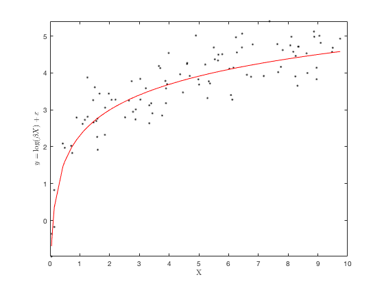
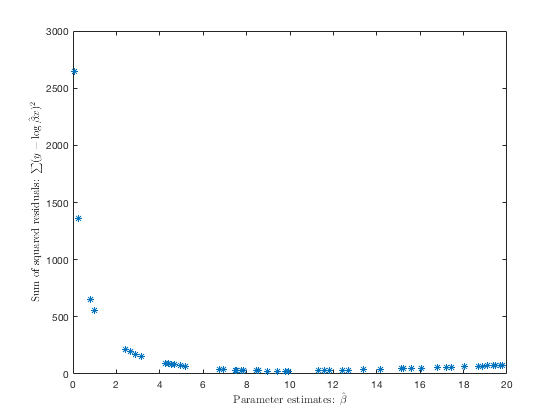
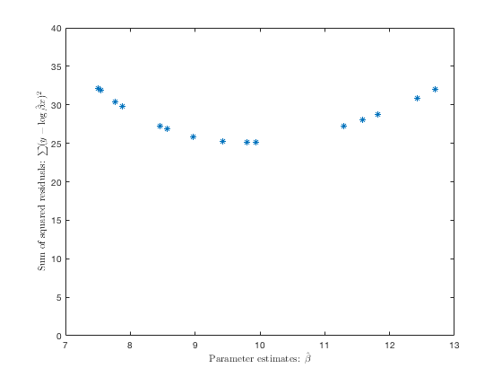
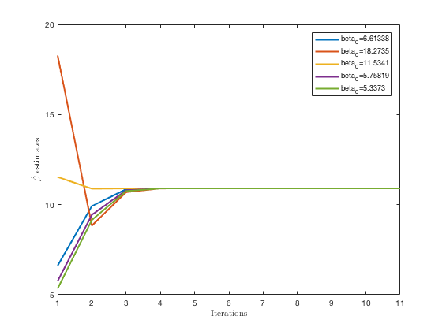
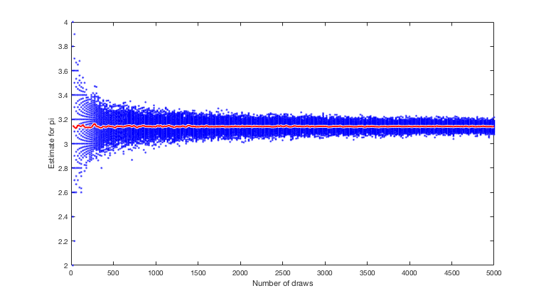

``` {r setup, echo = FALSE, message = FALSE, warning = FALSE}

knitr::opts_chunk$set(fig.width = 6, fig.height = 4, fig.path = 'Figs/',
                      echo = TRUE, message = FALSE, warning = FALSE)
library(tidyverse)
```

## Assignment 16 {.tabset}

### Problem 1

Generate $n$ values for $X$ and $\varepsilon$. Then pick a value for $\beta$ and generate $y = \log(\beta x) + \varepsilon$.

#### Part a)

Plot the sum squared residuals for various values of $\hat\beta$.

``` {r, eval = FALSE}
%% Set up variables and params
%    set parameters: number of samples, scale factor for X, variance for
%    epsilon
n = 100;
x_scale = 10;
eps_var = .25;

%  Generate X and epsilon vectors; X ~ u(0, x_scale), eps ~ n(0, eps_var)
X = sort(rand(n, 1) * x_scale);
eps = normrnd(0, sqrt(eps_var), n, 1);

%  Set up a true beta and some random betas around it
beta = 10; %rand(1) * 10;
beta_hats = rand(50, 1) * beta * 2;

%  calculate y from given formula
y = log(beta .* X) + eps;

%% plot y ~ X

figure;
plot(X, y, 'k.');
hold on;
plot(X, log(beta .* X), 'r');
ylim([min(y) max(y)]);
xlabel('X', 'Interpreter', 'latex'); 
ylabel('$y = \log(\beta X) + \varepsilon$', 'Interpreter', 'latex')

```

__First, the values of $y = \log \beta X + \varepsilon$ and $y^{*} = \log \beta X$__



``` {r, eval = FALSE}
%% calculate and plot sum of squared residuals
%  for each combination of (X, y) and each value of beta_hats

% sq_resid = zeros(length(y), length(beta_hats));
% for i = 1:length(beta_hats)
%     sq_resid(:, i) = (y - log(X * beta_hats(i))) .^ 2;
% end

sq_resid = (y - log(X * beta_hats')) .^ 2;

sum_sq_resid = sum(sq_resid);

figure;
plot(beta_hats, sum_sq_resid, '*')
xlabel('Parameter estimates: $\hat{\beta}$', 'Interpreter', 'latex');
ylabel('Sum of squared residuals: $\sum (y - \log\hat{\beta}x)^2$', 'Interpreter', 'latex')

figure;
plot(beta_hats, sum_sq_resid, '*')
xlabel('Parameter estimates: $\hat{\beta}$', 'Interpreter', 'latex');
ylabel('Sum of squared residuals: $\sum (y - \log\hat{\beta}x)^2$', 'Interpreter', 'latex')
xlim([7 13])
ylim([0 40])
```

__SSR vs. $\hat{\beta}$__



__SSR vs. $\hat{\beta}$ zoomed in to show minimum__



#### Part b)

Define $dg = \frac{\partial \log\beta x}{\partial\beta}$.  Pick an initial guess for $\beta, \beta^{(0)}$. Then regress $\mathcal{y}_i - \log\beta^{(j)}x_i$ on $dg^{(j)}$ calling the coefficient $\Delta$. Update according to $\beta^{(j + 1)} = \beta^{(j)} + \Delta$.  Iterate for a while and draw a plot to show what happens.

\begin{align*}
  y_i &= g(\beta, x_i) + \varepsilon_i = \log (\beta^{(j)}x_i) + \varepsilon_i\\
  \varepsilon_i &= \frac{\partial g}{\partial \beta} \Delta + v\\
  \Rightarrow y_i &- \log (\beta^{(j)}x_i) = \frac{\partial g}{\partial \beta} \Delta + v\\[12pt]
  dg &= \frac{\partial \log\beta X}{\partial\beta} = \frac{1}{\beta X}X = \frac{1}{\beta}\\[12pt]
  \Rightarrow \hat{\Delta} &= \frac{2 \sum_{i=1}^n (y - \log(\beta^{(j)}x_i)) (\frac{1}{\beta^{(j)}})}
      {2 \sum(1/\beta^{(j)})^2}\\
    &= \frac{ \beta^{(j)}\sum_i (y_i - log(x_i \beta^{(j)})) }{n}\\
    &= \beta^{(j)}\bar{y} - \frac{\beta^{(j)}}{n}\sum log(x_i) - log \beta^{(j)}
\end{align*}

``` {r, eval = FALSE}
beta_j    = zeros(11, 1);
y_bar = mean(y);

figure
for (i = 1:5) % iterate from several starting points
    beta_j(1) = beta_hats(i); % initialize beta_j from beta_hats
    for (j = 1:10)
        delta_hat = (y_bar - log(beta_j(j)) - sum(log(X))/n) * beta_j(j)

        beta_j(j + 1) = beta_j(j) + delta_hat;
    end
    plot([1:length(beta_j)], beta_j, 'LineWidth', 2)
    hold on
end
xlabel('Iterations', 'Interpreter', 'latex')
ylabel('$\hat{\beta}$ estimates', 'Interpreter', 'latex')
legend(strcat('beta_0=', string(beta_hats(1:5))))
```



### Problem 2

Compute an estimate of $\pi$ by the following technique of Monte Carlo integration. Draw random $\{x, y\}$ pairs uniform between 0 and 1. Then decide if the point is inside or outside the unit circle. Since the fraction of points inside the unit circle corresponds to the area of a quarter unit circle, you can estimate $\pi$ by four times the fraction inside the circle. Do this for a various numbers of random draws and plot the estimates of $\pi$ against the number of draws.

``` {r estimate_pi, eval = FALSE}
function [pi_est] = estimate_pi(draws, reps)
%%  Estimate pi using Monte Carlo integration
%   Draws random x, y points from U(0, 1) and computes proportion that fall 
%   within a unit circle; multiply this by 4 to get an estimate for pi.
%   Arguments:
%     draws = number of (x, y) points to draw in sample
%     reps  = number of samples to draw and compute
%   Returned value:
%     A vector of pi estimates, of length equal to reps.

    % Assign random values to 3-d matrix; last dimension is 2 to contain [x y]
    xy_matrix = rand(draws, reps, 2);

    % Calculate distance from zero for each (x, y) point
    xy_dist = xy_matrix(:, :, 1).^2 + xy_matrix(:, :, 2).^2;

    % For each rep, sum the points within the circle, and divide by draws.
    pi_est = 4 * sum(xy_dist < 1) / draws;

end
```

``` {r plot_pi_estimates, eval = FALSE}
reps = 200;
draw_vals = [20:20:5000];

% initialize matrix for estimates
pi_est = zeros(length(draw_vals), reps);

% generate estimates in a loop
for i = 1:length(draw_vals)
    pi_est(i, :) = estimate_pi(draw_vals(i), reps);
end

% plot estimates and mean for each number of draws
pi_mean = mean(pi_est');

plot(draw_vals, pi_est, 'b.')
xlabel('Number of draws'); ylabel('Estimate for pi');
hold on;
plot(draw_vals, pi_mean, 'w', 'LineWidth', 4);
plot(draw_vals, pi_mean, 'r', 'LineWidth', 2);
hold off;
```


