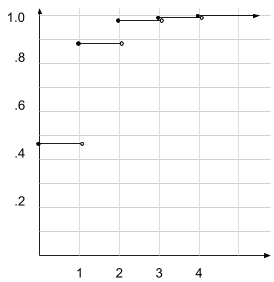

``` {r setup, echo = FALSE, message = FALSE, warning = FALSE}

knitr::opts_chunk$set(fig.width = 6, fig.height = 4, fig.path = 'Figs/',
                      echo = TRUE, message = FALSE, warning = FALSE)
```

### Problems from assignment sheet

\begin{enumerate}
\item\textbf{The probability that it rains in city $A$ is 0.5, the probability
  that it rains in city $B$ is 0.3, and the probability that it rains in both 
  is 0.15. Find the probability of each of these events:}
  \begin{enumerate}
  \item It does not rain in either city. \\
  	Does not rain in $A$ = $P(A^c) = 1 - P(A)$ (and similar for $B$)
	  \begin{align*}
	    P(A^c \cap B^c) &= (1 - P(A)) * (1 - P(B))\\
	      &= 0.5 * 0.7 = 0.35
    \end{align*}

  \item It rains in both cities.
	  \begin{align*}
	    P(A \cap B) &= P(A) * P(B)\\
	      &= 0.5 * 0.3 = 0.15
    \end{align*}
    (also, given...)
    
  \item It rains in at least one city.
	  \begin{align*}
	    P(A \cup B) &= P(A) + P(B) - P(A \cap B)\\
	      &= 0.5 + 0.3 - 0.15 = 0.55
    \end{align*}
  \end{enumerate}

  \item\textbf{Consider two events $A$ and $B$ such that $P(A) = 1/5$ and 
    $P(B) = 1/3$. Find $P(B \cap A^c)$ for each of these cases:}
    \begin{enumerate}
    \item $A$ and $B$ are disjoint\\
      If $A$ and $B$ are disjoint, then $P(B \cap A^c) = P(B) = 1/3$.
    \item $B\subset A$\\
      For this specific circumstance, since $P(A) < P(B)$, $B$ cannot be a subset of $A$.  But in general, if $B \subset A$ then $\forall x \in B, x \in A$; so $\forall x \in B, x\not\in A^c$, so $P(B \cap A^c) = 0$.
    \item $P(B \cap A^c) = 1/7$\\
      $P(B \cap A^c) = P(B) - P(A \cap B)$ (from thm 1.2.9a) $ = 1/3 - 1/7 = \frac{4}{21}$
  \end{enumerate}

\item\textbf{Consider two events $A$ and $B$ with $P(A) = 0.4$ and 
  $P(B) = 0.7$.  Determine the minimum and maximum values of $P(A \cap B)$ 
  and the conditions under which each is attained.}\\
  The minimum occurs at $P(A \cap B) = P(A) + P(B) - 1 = 0.1$.\\
    \begin{tikzpicture}
      % a straight line segment
      \draw (1,0) -- (11,0);
      % the ticks and their labels
      \foreach \x  in {1,...,10}
        \draw[xshift=\x cm] (0pt,2pt) -- (0pt,-1pt) node[below,fill=white] {};
      % the thicker segment
      \draw[ultra thick] (1,.1) -- (8,.1);
      \draw[ultra thick, blue] (7,.2) -- (11,.2);
      \draw[ultra thick, red] (7,.3) -- (8,.3);
      % the labels
      \node[fill=white,draw=black,circle,inner sep=2pt,label=below:{$0.0$}] at (1,0) {};
      \node[fill=white,draw=black,circle,inner sep=2pt,label=below:{$1.0$}] at (11,0) {};
      \node at (4.5,.3) {$A$};
      \node[blue] at (9.5,.4) {$B$};
      \node[red] at (7.5,.5) {$A\cap B$};
    \end{tikzpicture}\\
  The maximum occurs when one set is a subset of the other; in this case when 
    $A \subset B$, and $P(A \cap B) = P(A) = 0.4$.\\
    \begin{tikzpicture}
      % a straight line segment
      \draw (1,0) -- (11,0);
      % the ticks and their labels
      \foreach \x  in {1,...,10}
        \draw[xshift=\x cm] (0pt,2pt) -- (0pt,-1pt) node[below,fill=white] {};
      % the thicker segment
      \draw[ultra thick] (2.3,.1) -- (9.3,.1);
      \draw[ultra thick, blue] (4.1,.2) -- (8.1,.2);
      \draw[ultra thick, red] (4.1,.3) -- (8.1,.3);
      % the labels
      \node[fill=white,draw=black,circle,inner sep=2pt,label=below:{$0.0$}] at (1,0) {};
      \node[fill=white,draw=black,circle,inner sep=2pt,label=below:{$1.0$}] at (11,0) {};
      \node at (2.8,.3) {$A$};
      \node[blue] at (8.3,.3) {$B$};
      \node[red] at (6.1,.5) {$A\cap B$};
    \end{tikzpicture}

\end{enumerate}

### Problems from Casella and Berger 

1.2  __Verify the following identities.__
\begin{enumerate}
\item $A - B = A - (A \cap B) = A \cap B^c$
  \begin{align*}
    A - B &= \{x:x \in A \land x \not\in B\} & \text{(def of set subtraction)}\\
      &= A \cap B^c & \text{left hand side = right hand side}\\[6 pt]
    A - (A \cap B) &= \{x:x \in A \land \neg (x \in A \land x \in B)\}
        & \text{(def of set subtraction)}\\
      &= A \cap (A \cap B)^c   & \text{(write as set operations)}\\
      &= A \cap (A^c \cup B^c) & \text{(DeMorgan's laws)}\\
      &= (A \cap A^c) \cup (A \cap B^c)  & \text{(distributivity)}\\
      &= 0 \cup (A \cap B^c) = (A \cap B^c) & \text{middle = right hand side}
  \end{align*}
  
\item $B = (B \cap A) \cup (B \cap A^c)$
  \begin{align*}
    (B \cap A) \cup (B \cap A^c) &= B \cap (A \cup A^c)  & \text{(un-distribute)}\\
    A \cup A^c &= \text{ universal set }\mathbb{U} 
        & \text{(set + complement = all values)}\\
    B \cap \mathbb{U} &= B
  \end{align*}
  
\item $B - A = (B \cap A^c)$
  \begin{align*}
    B - A &= \{x:x \in B \land x \not\in A\} & \text{(def of set subtraction)}\\
          &= \{x:x \in B\} \cap \{x:x \not\in A\} & \text{(split set definition)}\\
          &= B \cap A^c & \text{(rewrite as set operations)}
  \end{align*}

\item $A \cup B = A \cup (B \cap A^c)$
  \begin{align*}
    A \cup B     &= (A \cup B) \cap (A \cup A^c) & \text{(distributivity)}\\
    (A \cup A^c) &= \mathbb{U} & \text{(set + complement = all)}\\
    A \cup B     &= (A \cup B) \cap \mathbb{U} & \text{(substitute)}\\
                 &= (A \cup B)\\
  \end{align*}
\end{enumerate}

1.6 __Two pennies, one with $P(heads_1) = u$ and one with $P(heads_2) = w$, are to be tossed together independently.  Define:__
  \begin{itemize}
  \item $p_0 = P(0 \text{ heads occur})$
    \begin{align*}
      p_0 &= P(\neg heads_1 \land \neg heads_2) \\
          &= P(h_1^c) * P(h_2^c)\\
          &= (1 - u)(1 - w) = 1 - u - w + uw\\
    \end{align*}
  \item $p_1 = P(1 \text{ heads occurs})$
    \begin{align*}
      p_1 &= P(heads_1 \lor heads_2)\\
          &= P(h_1) + P(h_2) - P(h_1 \cap h_2)\\
          &= u + w - uw\\
    \end{align*}
  \item $p_2 = P(2 \text{ heads occur})$
    \begin{align*}
      p_2 &= P(heads_1 \land heads_2)\\
          &= P(h_1) * P(h_2)\\
          &= uw\\
    \end{align*}
  \end{itemize}
  
  __Can $u$ and $w$ be chosen such that $p_0 = p_1 = p_2$? Prove your answer.__
  
  Proof by contradiction, to show: $\exists (u, w) \in [0, 1] \ni p_0 = p_1 = p_2$.
  __Proof:__  Suppose (toward contradiction) $p_0 = p_1 = p_2$.
  \begin{align*}
    &\Longrightarrow 1 - u - w + uw = u + w - uw = uw   &\text{(from defs above)}\\
    &\Longrightarrow 1 - u - w = u + w = 0              &\text{(subtract uw)}\\
    &\Longrightarrow (u + w = 1) \land (u + w = 0)      &\text{Aha! a contradiction!}
    & & \blacksquare
  \end{align*}
  Thus, no...  there are no values for $u$ and $w$ $\in [0, 1]$ that allow for $p_0 = p_1 = p_2$.

1.35 __Prove that if $P(\cdot)$ is a legit probability function and $B$ is a set with $P(B) > 0$, then $P(\cdot | B)$ also satisfies Kolmogorov's Axioms.__

  To show: $P(\cdot | B)$ satisfies Kolmogorov's Axioms.
  __Proof:__  Let $P(\cdot)$ be a probability function that satisfies Kolmogorov's Axioms.
  \begin{align*}
    &\Longrightarrow P(\cdot) \geq 0, \forall \cdot  & \text{(by axiom 1)}\\
    &\Longrightarrow P(\cdot | B) = P(\cdot \cap B) / P(B)   & \text{(Bayes thm)}\\
    &\Longrightarrow P(\cdot \cap B) / P(B) \geq 0  & \text{(all components +)}\\
    &\Longrightarrow P(\cdot | B) \geq 0            &\text{(satisfies axiom 1)}\\[6 pt]
    &\Longrightarrow P(S) = 1                       & \text{(by axiom 2)}\\
    &\Longrightarrow P(S|B) = P(S \cap B) / P(B)    & \text{(Bayes thm)}\\
    &\Longrightarrow P(S|B) = P(B)/P(B) = 1         & \text{(satisfies axiom 2)}\\[6 pt]
    &\Longrightarrow \text{if $A_1, A_2,...$ are pairwise disjoint, }
      P(\bigcup_{i=1}^\infty A_i) = \sum_{i=1}^\infty P(A_i) &\text{(by axiom 3)}\\
    &\Longrightarrow P(\bigcup_{i=1}^\infty A_i|B) = 
        \frac{P(\bigcup_{i=1}^\infty A_i \cap B)}{P(B)} 
        &\text{(Bayes thm)}\\
    &\Longrightarrow P(\bigcup_{i=1}^\infty A_i|B) = 
        \frac{\sum_{i=1}^\infty P(A_i \cap B)}{P(B)} 
        &\text{(by axiom 3)}\\
    &\Longrightarrow P(\bigcup_{i=1}^\infty A_i|B) = 
        \sum_{i=1}^\infty \frac{P(A_i \cap B)}{P(B)} 
        &\text{(distribute $1/P(B)$ into sum)}\\
    &\Longrightarrow P(\bigcup_{i=1}^\infty A_i|B) = 
        \sum_{i=1}^\infty P(A_i | B)
        &\text{(satisfies axiom 3)}\\
    & & \blacksquare
  \end{align*}

1.39 __A pair of events $A$ and $B$ connot be simultaneously _mutually exclusive_ and _independent_.  Prove that if $P(A) > 0$ and $P(B) > 0$, then:__

  \begin{itemize}
  \item If $A$ and $B$ are mutually exclusive, they cannot be independent.
  \item If $A$ and $B$ are independent, they cannot be mutually exclusive.
  \end{itemize}
  __Proof by contradiction__, show that $(P(A|B) = \emptyset) \land (P(A|B) = P(A))$.
  Suppose toward contradiction that $A$ and $B$ are both mutually exclusive and independent.
  \begin{align*}
    &\Longleftrightarrow A \cap B = 0   &\text{(def of mutually exclusive)}\\
    &\Longleftrightarrow P(A|B) = P(A)  &\text{(def of independent)}\\
    &\Longleftrightarrow P(A|B) = \frac{P(A \cap B)}{P(B)} &\text{(Bayes thm)}\\
    &\Longleftrightarrow P(A|B) = \frac{0}{P(B)}   &\text{(from mutually exclusive)}\\
    &\Longleftrightarrow P(A|B) = 0 = P(A)         &\text{contradiction!}\\
    & & \blacksquare
  \end{align*}
  If $A$ and $B$ are both mutually exclusive and independent, this results in a 
    contradiction, proving both (a) and (b).
  
1.47 __Prove that the following functions are cdfs.__  To be a cdf, a function must meet the criteria:

  a. $\lim_{x \rightarrow -\infty}F(x) = 0$ and $\lim_{x \rightarrow \infty}F(x) = 1$.
  b. $F_X(x)$ is non-decreasing function of x.
  c. $F_X(x)$ is right-continuous.

  * $F_X(x) = e^{-e^{-x}}, x \in (-\infty, \infty)$.  To show $F_X(x)$ meets criteria a, b, c above,  __Proof:__
  
    \begin{align*}
      &\Longrightarrow \lim_{x \rightarrow -\infty}e^{-e^{-x}} = 
        e^{-e^\infty} = e^{-\infty} = 0\\
      &\Longrightarrow \lim_{x \rightarrow \infty}e^{-e^{-x}} = 
        e^{-e^{-\infty}} = e^{0} = 1\\
      &\Longrightarrow F_X(x) \text{ meets limits (criteria a)}\\[6 pt]
      &\Longrightarrow \frac{d(e^{-e^{-x}})}{dx} = e^{-e^{-x} - x}\\
      &\Longrightarrow \frac{d(e^{-e^{-x}})}{dx} > 0, \forall x\\
      &\Longrightarrow F_X(x) \text{ is increasing function of $x$}\\[6 pt]
      &\Longrightarrow F_X(x) \text{ is exponential, thus continuous over all $x$}\\
      && \blacksquare
    \end{align*}

  * $F_X(x) = 1 - e^{-x}, x \in (0, \infty)$.  To show $F_X(x)$ meets criteria a, b, c above,  __Proof:__
  
    \begin{align*}
      &\Longrightarrow \text{approaching 0 from above, } \lim_{x \rightarrow 0}1 - e^{-x} = 
        1 - e^{0} = 0\\
      &\Longrightarrow \text{below 0, $F_X(x) = 0$, so } \lim_{x \rightarrow -\infty}0 = 0\\
      &\Longrightarrow \lim_{x \rightarrow \infty}1 - e^{-x} = 
        1 - 0 = 1\\
      &\Longrightarrow F_X(x) \text{ meets limits (criteria a)}\\[6 pt]
      &\Longrightarrow \frac{d(1 - e^{-x})}{dx} = e^{-x}\\
      &\Longrightarrow \frac{d(1 - e^{-x})}{dx} > 0, \forall x\\
      &\Longrightarrow F_X(x) \text{ is increasing function of $x$}\\[6 pt]
      &\Longrightarrow F_X(x) \text{ is exponential for $x>0$ and 0 else, 
        thus continuous over all $x$}\\
      && \blacksquare
    \end{align*}
  

1.49 __A cdf $F_X$ is _stochastically greater_ than a cdf $F_Y$ if $F_X(t) \leq F_Y(t)$ for all $t$ and $F_X(t) < F_Y(t)$ for some $t$.  Prove that if $X ~ F_X$ and $Y ~ F_Y$, then

* $P(X > t) \geq P(Y > t)$ for every $t$, and
* $P(X > t) > P(Y > t)$ for some $t$.

__Proof:__  Let $F_X(t) = P(X \leq t) \leq F_Y(t)$ for all $t$ (by hypothesis).
\begin{align*}
  &\Longrightarrow F_X(t) = P(X \leq t) \leq 
    F_Y(t) = P(Y \leq t)  &\text{(def of CDF)}\\
  &\Longrightarrow -F_X(t) = -P(X \leq t) \geq
    -F_Y(t) = -P(Y \leq t) &\text{(multiply by -1, flip inequality)}\\
  &\Longrightarrow 1 - F_X(t) = 1 - P(X \leq t) \geq
    1 - F_Y(t) = 1 - P(Y \leq t) &\text{(add 1 each side)}\\
  &\Longrightarrow 1 - F_X(t) = P(X > t) \geq
    1 - F_Y(t) = P(Y > t) &(1 - P(x) = P(x^c))\\
  &\Longrightarrow P(X > t) \geq P(Y > t) \text { for all $t$}\\[6 pt]
  &\Longrightarrow P(X > t) > P(Y > t) \text { for some $t$} 
    &\text{(same process for > as for $\geq$)}\\
  & & \blacksquare
\end{align*}

1.51 __An appliance store receives a shipment of 30 microwave ovens, 5 of which are (unknown to the manager) defective.  The store manager selects 4 at random, without replacement, and tests to see if they are defective.  Let $X$ = the number of defectives found.  Calculate the pmf and cdf of $X$ and plot the cdf.__

* To choose $X$ defective means both $X$ defective out of 5, and $4 - X$ good 
  out of 25.  This can be written as ${5 \choose X}$ and ${25 \choose 4 - X}$ 
  out of ${30 \choose 4}$ possible combinations.
  
  \begin{align*}
    f_X(x) = \begin{cases}
      \frac{{5 \choose 0}{25 \choose 4}}{{30 \choose 4}}
        = \frac{\frac{5!}{0!5!}*\frac{25!}{4!21!}}{\frac{30!}{4!26!}}
        = 12650/27405 = .46159, & X = 0\\
      \frac{{5 \choose 1}{25 \choose 3}}{{30 \choose 4}}
        = \frac{\frac{5!}{1!4!}*\frac{25!}{3!22!}}{\frac{30!}{4!26!}}
        = 11500/27405 = .41963, & X = 1\\
      \frac{{5 \choose 2}{25 \choose 2}}{{30 \choose 4}}
        = \frac{\frac{5!}{2!3!}*\frac{25!}{2!23!}}{\frac{30!}{4!26!}}
        = 3000/27405 = .10947, & X = 2\\
      \frac{{5 \choose 3}{25 \choose 1}}{{30 \choose 4}}
        = \frac{\frac{5!}{3!2!}*\frac{25!}{1!24!}}{\frac{30!}{4!26!}}
        = 250/27405 = .00912, & X = 3\\
      \frac{{5 \choose 4}{25 \choose 0}}{{30 \choose 4}}
        = \frac{\frac{5!}{4!1!}*\frac{25!}{0!25!}}{\frac{30!}{4!26!}}
        = 5/27405 = .000182, & X = 4\\
      0, &\text{else}
    \end{cases}
  \end{align*}
  \begin{align*}
    F_X(x) = \begin{cases}
      0, & X < 0\\
      .46159, & X < 1\\
      .88122, & X < 2\\
      .99069, & X < 3\\
      .99981, & X < 4\\
      1, & X \geq 4
    \end{cases}
  \end{align*}
    


1.54 (b) __Determine the value of $c$ that makes $f(x)$ a pdf:__

* $f(x) = ce^{-|x|}, -\infty < x < \infty$

Integrate across the entire support, then determine $c$ such that the integral sums to 1.

\begin{align*}
  \int_{-\infty}^{\infty} f(x) &= \int_{-\infty}^0 ce^{x}dx + \int_{0}^\infty ce^{-x}dx\\
  &= ce^x |_{-\infty}^0 + -ce^{-x} |_0^\infty\\
  &= c(1 - 0) - c(0 - 1) = 2c
\end{align*}

So $c = 1/2$.
