```{r, echo = F}

# source('https://raw.githubusercontent.com/oharac/src/master/R/common.R')
### loads tidyverse packages, defines helper functions

```


# The Question

### 

#### How will climate risk beliefs affect coastal housing market dynamics?

- Heterogeneity in beliefs about future value of fundamentals can lead to inflated prices, bubbles, excess volatility, credit crises, etc.
- Heterogeneous beliefs about flood risks due to sea level rise (SLR) have implications for coastal housing markets
- Standard approaches to modeling economic impacts of SLR assume homogeneous beliefs
- This likely underestimates impacts of SLR and climate change

### Motivation

#### Flood risk

- Climate change increases precipitation and storm surge
- This leads to catastrophic events
    - Harvey (2017), Sandy (2012), Katrina (2005) etc.
- FEMA flood maps often out of date, backward-looking

### Motivation

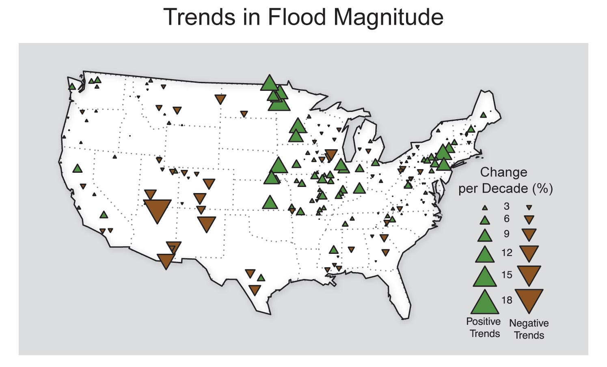

### US Flood policy

1968: National Flood Insurance Program (NFIP) under Federal Emergency Management Agency (FEMA)

* 5M policies nationwide covering >$1.2T
* $250k property policy limit
* Limited enforcement & low risk perceptions $\Rightarrow$ many homes are un- or under-insured
* Subsidies; rates not at actuarially fair levels

Takeaway: Homeowners do not internalize real risk

### US Flood policy

Moves to improve NFIP

* Biggert-Waters (2012)
    * Goal: phase out subsidies and enforce actuarially fair rates
* Homeowner Flood Insurance Affordability Act (2014)
    * Partially repealed Biggert-Waters

But optimal policy will eventually be put in place (...?)

# The Moving Parts

### 

#### The Moving Parts

- Dynamic housing market model with heterogeneity in risk beliefs
- Learning mechanism to allow agents to update risk beliefs
- Survey to quantify beliefs about amenity values and risk perceptions
- Simulation to estimate impacts of risk belief heterogeneity

## Housing Market Model

### Dynamic housing market

Builds upon Burnside, Eichenbaum, Rebelo (2016) on booms and busts in housing markets.

- Continuum of agents (households) with linear utility, discount rate $\beta$
- Heterogeneity in home types (coastal, non-coastal), prefs for coastal amenities, and flood risk beliefs
- Each period, agents choose among:
    - buy coastal home at price $P_t$
    - buy non-coastal home at price $P_t^{NC}$
    - rent
- Home price determined by valuation of marginal buyer, indifferent among options

### Dynamic housing market

- Households are heterogeneous in preferences:
    - $\xi^i$ coastal amenity value
    - $\pi_t^i$ annual flood risk belief
- Fraction $k_1$ of homes are "coastal" properties
- Fixed housing stock for sale: $k < 1$, where $k_1 < k < 1$ is coastal
- Rental market: $1 - k$ houses, rental rate $w$ per period
- Flow of utility $\eps^h$ (homeowner) and $\eps^r$ (renter)
- Coastal homes have higher utility value $\xi^i$ but incur flood damage $\delta$ with probability $\pi^*_t$.

### Dynamic housing market

Home price determined by valuation of marginal buyer $m_t$, indifferent among options:

$$-P_t + \beta(\eps^h + \xi^{m_t} - 
      \pi_t^{m_t}\delta + \EE_t^{m_t}[P_{t+1}])$$
$$= \beta(\eps^r - w)$$
$$= - P_t^{NC} + \beta(\eps^h + \EE_t^{m_t}[P_{t+1}^{NC}])$$

### Dynamic housing market

Define $e^h \equiv \eps^h - (\eps^r - w)$ and solving for $P_t$ results in pricing condition for coastal homes:

$$P_t = \beta(e^h + \xi^{m_t} - \pi_t^{m_t}\delta + \EE_t^{m_t}[P_{t+1}])$$

* $\EE_t^{m_t}[P_{t+1}]$ includes marginal buyer's higher order expectations of own and others' future flood risk beliefs
* For homogeneous and correct risk beliefs $\pi_t^i$, price is based on amenity value only and changes smoothly in anticipation of changes in flood risk.
* For homogeneous amenity value $\xi^i$, price is based on flood risk belief of marginal buyer, which likely changes dramatically after storm events.

### Dynamic housing market

$$P_t = \beta(e^h + \xi^{m_t} - \pi_t^{m_t}\delta + \EE_t^{m_t}[P_{t+1}])$$

* Divide the population into two types: fraction $\theta^o$ optimists ($\pi^o_t$) and fraction $(1 - \theta^o)$ realists ($\pi^r_t$), with $\pi^o_t \leq \pi^r_t \forall t$.
* Coastal amenity independently distributed $\sim U[0, \Xi]$.
* This results in three possible cases of $P_T$ depending on identity of marginal buyer:

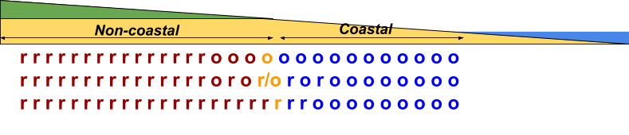

### Determining home price

$$P_t = \beta(e^h + \xi^{m_t} - \pi_t^{m_t}\delta + \EE_t^{m_t}[P_{t+1}])$$

#### Backward induction: $t = T$

A strong flood insurance requirement at actuarially appropriate rates forces agents to internalize flood risk, regardless of risk beliefs.  Policy efforts e.g. Biggert-Waters Flood Insurance Reform Act of 2012 attempt to approach such a policy.

Assume such a policy is put into place in period $T$, then:
$$\pi_T^o = \pi_T^r = \pi_T^*$$

### Determining home price

#### Backward induction: $t = T-1$

In period $T-1$, optimists and realists hold expectations over the policy to be announced in period $T$:
$$\EE_{T-1}^r[\pi_T^*] = \pi_T^{*,r} \text{ and } \EE_{T-1}^o[\pi_T^*] = \pi_T^{*,o}$$
which affects their expectations about future home prices $P_T$, thus price $P_{T-1}$.

Backing up to period $T-2$, expectations over prices are based on each agent's expectation of the expectations of other agents about the marginal buyer and risk beliefs for periods $T-1$ and $T$.  This quickly becomes a nightmare.

## Benchmark model

### Structure 

* Flood risk $\pi^L$ until period $T_1$, then increases to $\pi^H$.
* Realists know true flood risk at all times
    * thus do not update beliefs in response to flood events.
* Optimists know initial flood risk, and become Bayesian learners at time $T_1$
    * i.e. update prior in response to flood events.

### Bayesian learning

Based on Dieckmann (2011): Optimist estimate of flood risk in time $t \geq T_1$ is
$$\pi^o_t = q_t^o(\pi^H) + (1 - q_t^o)(\pi^L)$$
And updated each period based on flood event occurrence:
\begin{align*}
  q^o_{t+1}|_{flood=1} &= \Pr(\pi^H|_{flood=1}) = 
      \frac{q_t^o (\pi^H)}{q_t^o (\pi^H) + (1 - q_t^o)(\pi^L)}\\
  q^o_{t+1}|_{flood=0} &= \Pr(\pi^H|_{flood=0}) = 
      \frac{q_t^o (1 - \pi^H)}{q_t^o (1 - \pi^H) + (1 - q_t^o)(1 - \pi^L)}\\
\end{align*}

### Bayesian learning

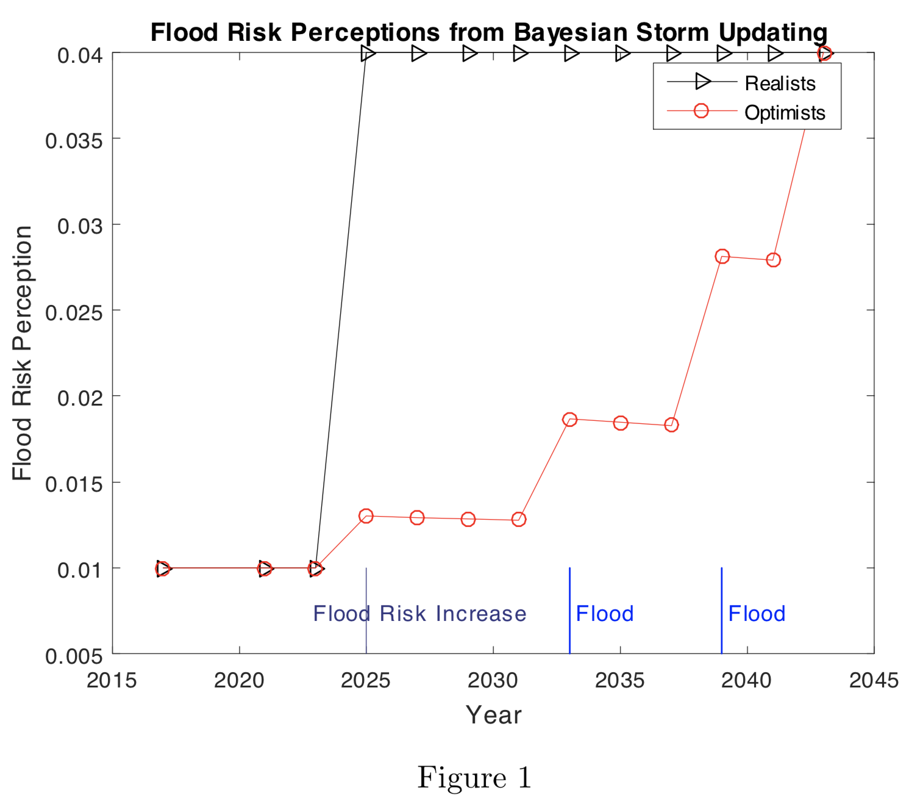

### Higher order beliefs

#### Beliefs about updating beliefs

* Realists have rational expectations that optimists will update their risk beliefs due to flood events
* Optimists don't anticipate changes in their own risk beliefs

#### Beliefs about enforced policy rates in time $T$

* Realists have accurate belief about eventual policy rate:
$$\EE_t^r[\pi^*_T] = \EE_t^r[\pi^r_T] = \pi^*$$
* Optimist beliefs in range of:
$$\EE_t^o[\pi^*_T] \in [\EE_t^o[\pi^o_T], \EE_t^o[\pi^r_T]]$$


## Survey

### Motivation

#### Quantify heterogeneity

Need to estimate joint distribution of amenity values and flood risk beliefs
$$PREM_t^{\text{coast}} \equiv (P_t - P_t^{NC}) = \beta(\xi^{m_t} - \pi_t^{m_t}\delta +
\EE_t^m[P_{t+1} - P_{t+1}^{NC}])$$

* The $\pi_t^{m_t}\delta$ term represents marginal buyer's current risk beliefs; 
* $\EE_t^m[P_{t+1} - P_{t+1}^{NC}]$ encompasses marginal buyer's expectation of future risk as well as beliefs about the risk expectations of others

### Survey

Rhode Island communities with both coastal (w/in 400' of ocean) and non-coastal homes: $n = 187$, 52% coastal/48% non-coastal

* WTP for annual flow of coastal amenities
* Quantitative flood risk perceptions
    * likelihood of flood within 10 years
* Qualitative flood risk perceptions
    * 10-point worry scale (1 = not worried, 10 = very worried)
* Potential confounders (could affect flood worries even without heterogeneity in risk beliefs)
    * Expectations of flood damage
    * Expectations of insurance reimbursement
    * Expectations of government aid

### Flood risk perception

Coastal residents are far less worried about flood risk than non-coastal residents

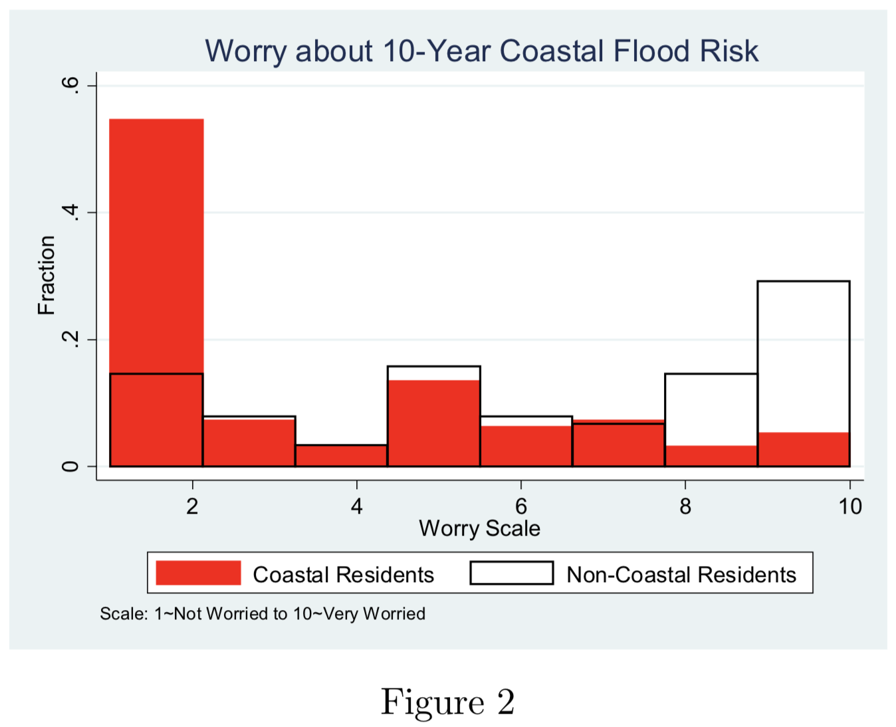

### Flood risk perception

NFIP floodzone residents are far less worried about flood risk than non-floodzone residents

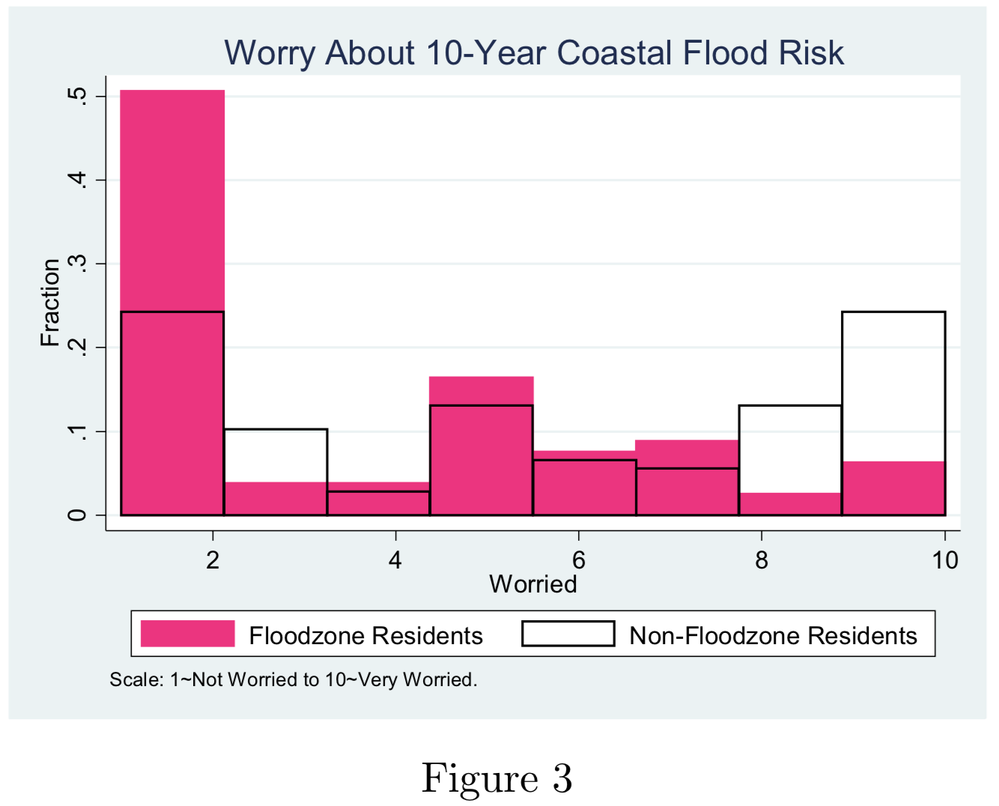

### Flood risk perception 

#### Are differences in apparent risk perception due to different expectations of unreimbursed damages?

Risk perceptions are not likely due to different expectations of damage as % of home value, net of expected insurance and government aid

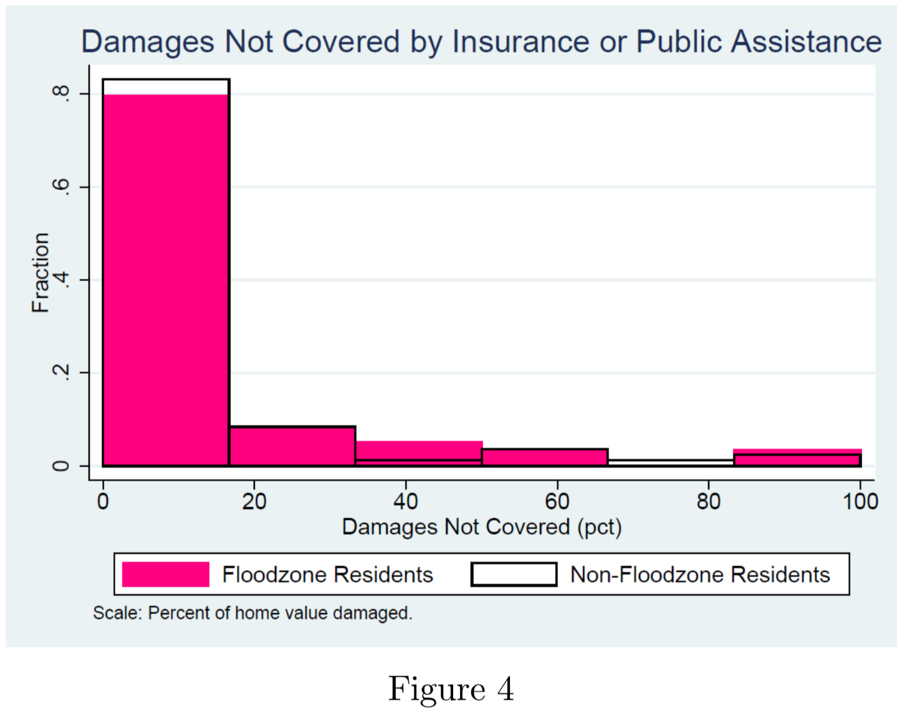

### Flood risk perception

Coastal residents underestimate flood risks vs. storm surge elevation risk models (70% of predictions below 1:1 line)

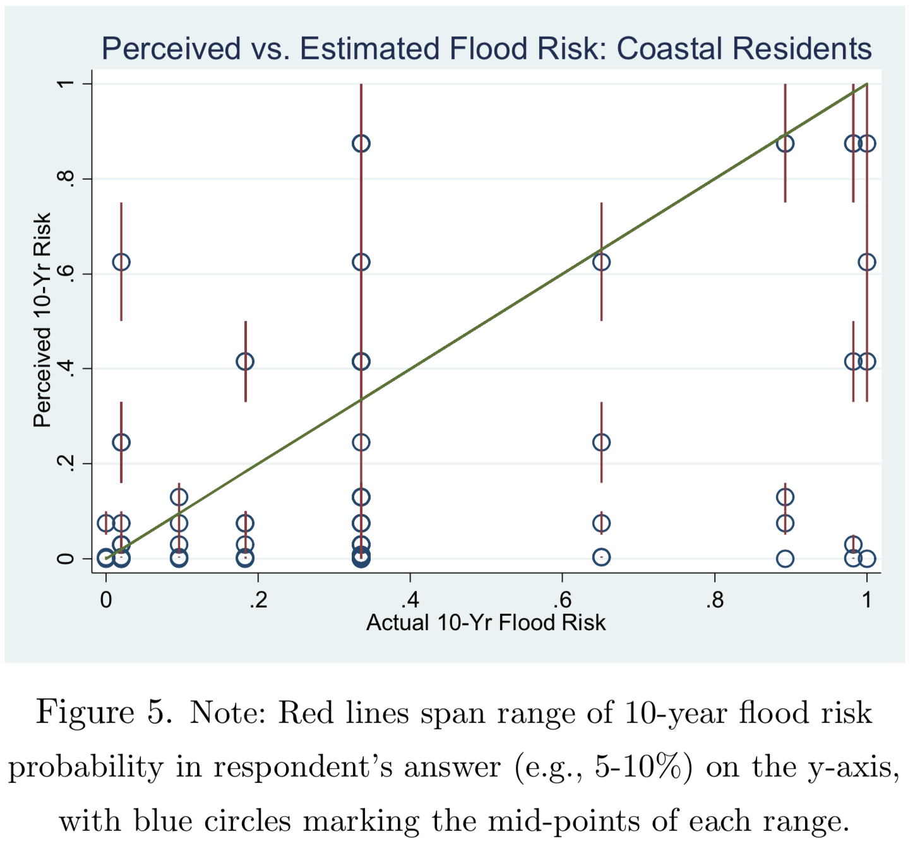

<!-- ### Flood risk perception -->

<!-- Additional points from the survey that support the model: -->

<!-- * Households that have experienced a flood have higher flood risk concerns -->
<!-- * Coastal households with high flood risk concern are more likely to sell their home in near future -->

### Expected flood risk change

* 1-year risk at least 1% $\Longrightarrow$ 10-year risk is 9.6%
* "Optimist" types underestimate 10-yr flood risk by $\geq$ 50%
* For this study area, optimist = risk assessment $\in$ [0%, 5%]

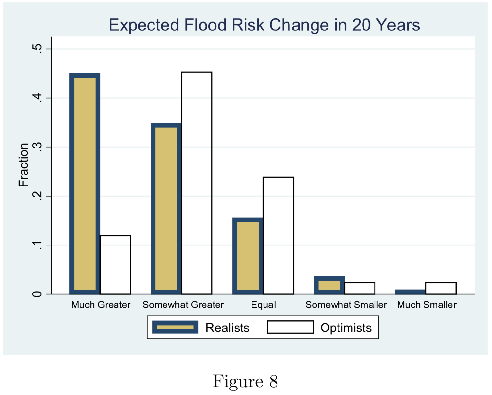

### Coastal amenity value

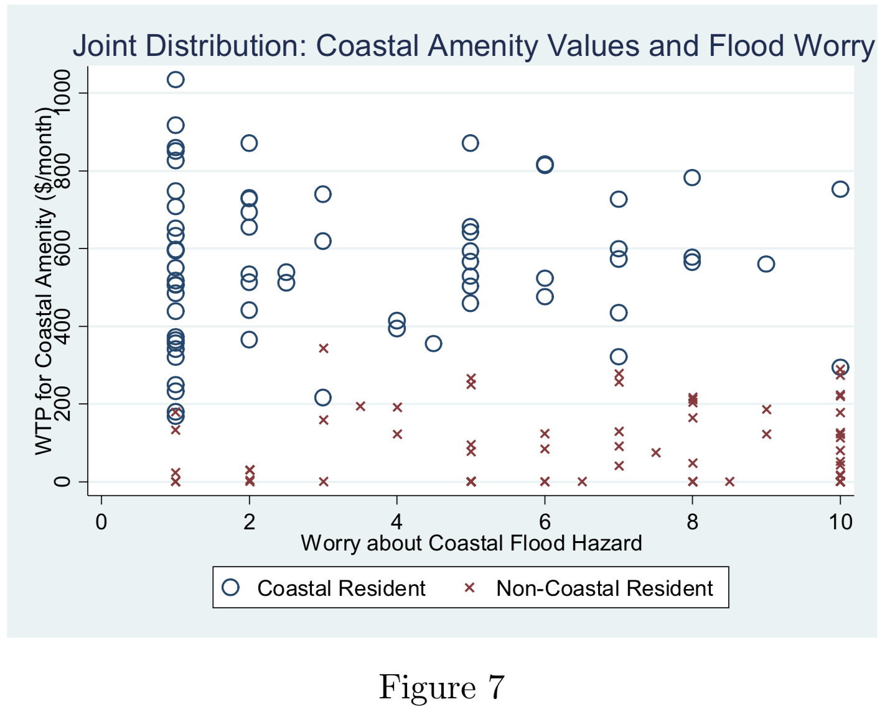


## Simulation

### Calibration

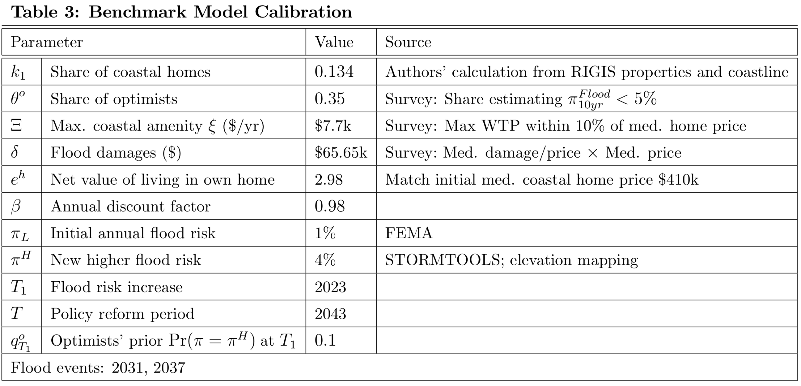

### Results


### Results

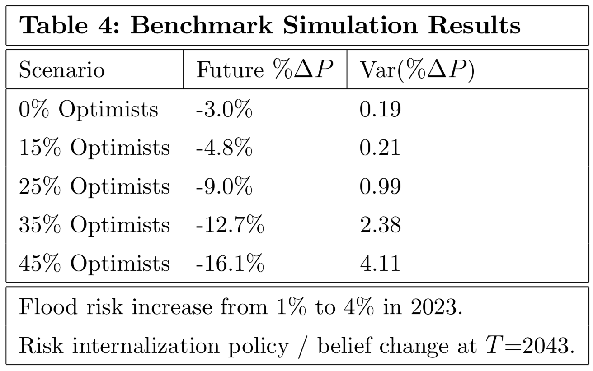

## Welfare and Allocative inefficiency

### Welfare costs not captured in model

Welfare costs due to coastal overvaluation and volatility:

* loans based on overvalued properties could lead to defaults and further asset losses
* local tax revenues based on property value would be affected by volatility and permanent price declines

### Allocative inefficiency

Amenity value would drive allocation in absence of belief heterogeneity.

Direct allocative inefficiency occurs when realists with high coastal amenity values get priced out of the coastal housing market due to optimists overvaluing coastal homes.

### Allocative inefficiency

Social planner would allocate coastal homes to those with $k_1$ highest amenity values:
$$\bar\xi^{*,o} = \bar\xi^{*,r} = \Xi(1 - k_1)$$
But allocative inefficiency occurs when marginal realist valuation 
exceeds marginal optimist valuation, $\bar\xi^{r}_t > \bar\xi^{*,r}$ 
and $\bar\xi^{o}_t < \bar\xi^{*,o}$.
$$\Delta W_t \equiv CS_t^* - CS_t = 
  \int_{q^{*,o}}^{q_t^o} \left[\Xi - \frac{\Xi}{\theta^o}q \right]dq -
  \int_{q^{r}}^{q_t^{*,r}} \left[\Xi - \frac{\Xi}{1 - \theta^o}q \right]dq$$
($q^i_t$ = qty of coastal housing consumed by group $i$ in period $t$)

### Allocative inefficiency

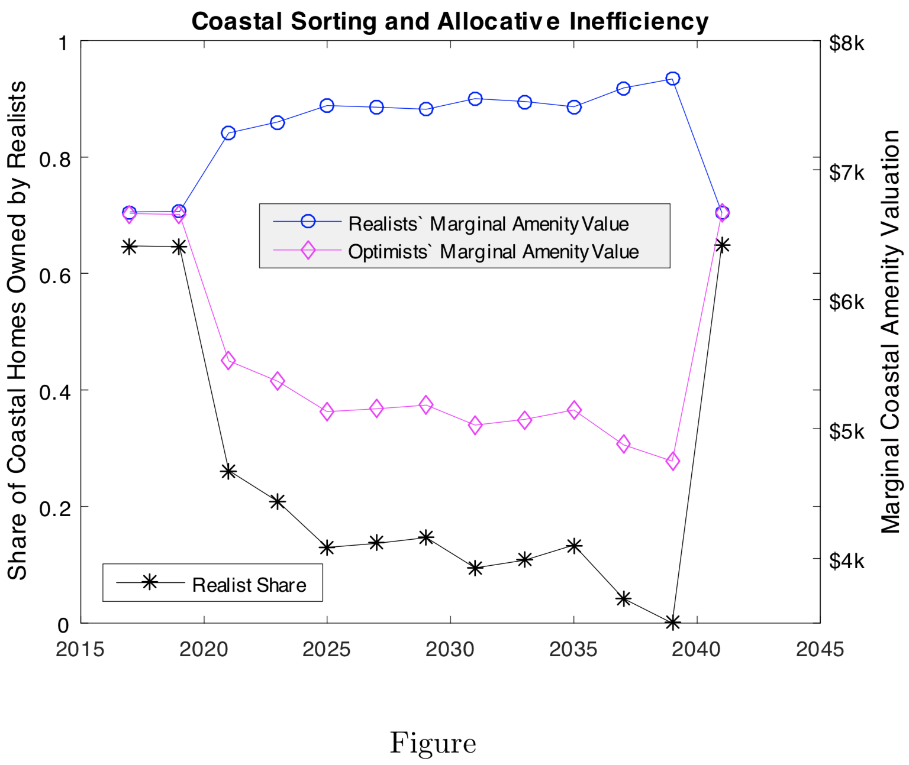

### Allocative inefficiency

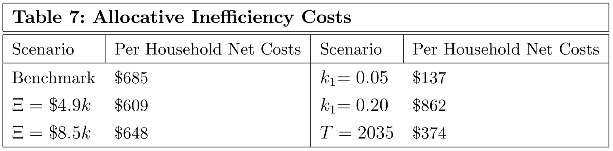

### Allocative inefficiency

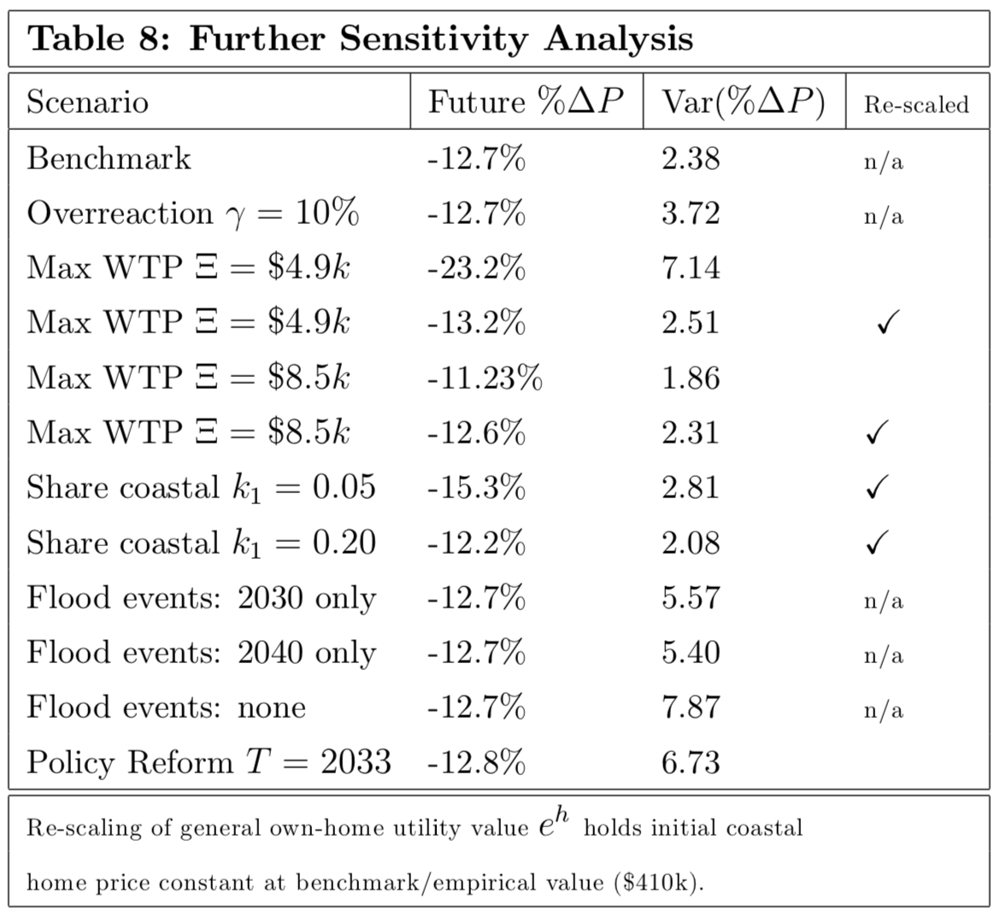

# Conclusions

## Other risks

### Wildfire


### Wildfire

Homeowners on wildland-urban interface bear heterogeneous beliefs about fire risk, and/or do not fully believe they will be forced to internalize costs: 

* Agents (home buyers) underestimate fire risk
* Agents under-insure or do not insure
* Fire fighting costs are borne by society


### Other natural disasters


### Other natural disasters

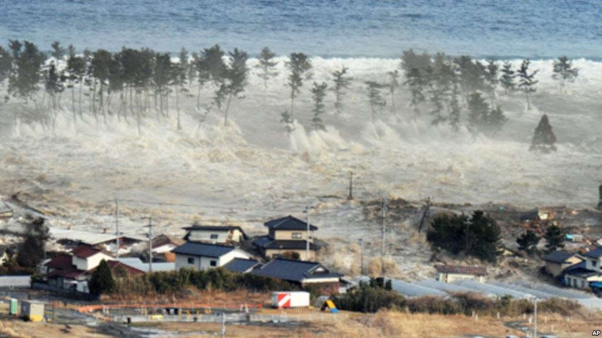

### Other natural disasters


## Policy implications

### Implications for flood insurance reform

Value of better flood risk information!

Impacts of flood insurance policy reform!

- Policy reform sooner reduces allocative inefficiency
- But at the cost of increased market volatility

### Implications

From Burnside, Eichenbaum, and Rebelo (2016): 

* Skeptics (realists?) are correct? $\Rightarrow$ boom then bust
* Optimists are correct? $\Rightarrow$ boom not followed by bust

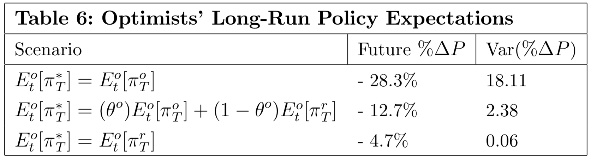

<!-- ### Implications -->

<!-- But everyone thinks they are the realists - whose beliefs should drive policy? -->

<!-- #### Aside:  -->

<!-- Brunnermeier et al (2014) develop a welfare criterion for models with heterogeneously distorted beliefs where a social planner does not need to decide who is "correct" - belief-neutral efficiency.  -->

### Implications

* If policy reflects realist beliefs, optimists suffer losses when price crashes.  
    * Arbitrage opportunity? realists could short sell in anticipation of crash
* If policy reflects optimist beliefs, optimists benefit from elevated value while imposing social costs on others
    * Political pressure to maintain elevated value could affect long-term policy
    * e.g. 2014 partial rollback of Biggert-Waters

### Opportunity?

* Social or private investment in actual risk reduction?  
    * Optimists could support investment in coastal engineering (bleh) or coastal protection ecosystem services (yay!) to reduce risk
* How does this affect ecosystem service valuation?

# References

### References 1

* Housing dynamics
    * Burnside, C., Eichenbaum, M., & Rebelo, S. (2016). Understanding booms and busts in housing markets. _Journal of Political Economy, 124_(4), 1088-1147. 295 citations
* Heterogeneous beliefs
    * Brunnermeier, M. K., Simsek, A., & Xiong, W. (2014). A welfare criterion for models with distorted beliefs. _The Quarterly Journal of Economics, 129_(4), 1753-1797.
    * Dieckmann, S. (2011). Rare event risk and heterogeneous beliefs: The case of incomplete markets. _Journal of Financial and Quantitative Analysis, 46_(2), 459-488.

### References 2

* Floods and climate change effects on housing value
    * USGCRP, 2017: Climate Science Special Report: Fourth National Climate Assessment, Volume I [Wuebbles, D.J., D.W. Fahey, K.A. Hibbard, D.J. Dokken, B.C. Stewart, and T.K. Maycock (eds.)]. U.S. Global Change Research Program, Washington, DC, USA, 470 pp., doi: 10.7930/J0J964J6.
    * Ortega, F., & Taspinar, S. (2018). Rising Sea Levels and Sinking Property Values: Hurricane Sandy and New York’s Housing Market. _Journal of Urban Economics_.
    * Severen, C., Costello, C., & Deschenes, O. (2018). A Forward-Looking Ricardian Approach: Do land markets capitalize climate change forecasts?. _Journal of Environmental Economics and Management, 89_, 235-254.

### References 3

* Ecosystem services
    * Farber, S., Costanza, R., Childers, D. L., ... & Warren, P. (2006). Linking ecology and economics for ecosystem management. _AIBS Bulletin, 56_(2), 121-133.
    * Narayan, S., Beck, M. W., Reguero, B. G., ... & Burks-Copes, K. A. (2016). The effectiveness, costs and coastal protection benefits of natural and nature-based defences. _PloS one, 11_(5), e0154735.

# Sensitivity analysis

### sensitivity analysis

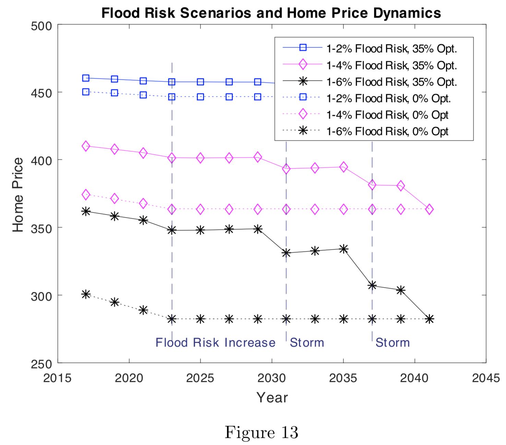

### sensitivity analysis

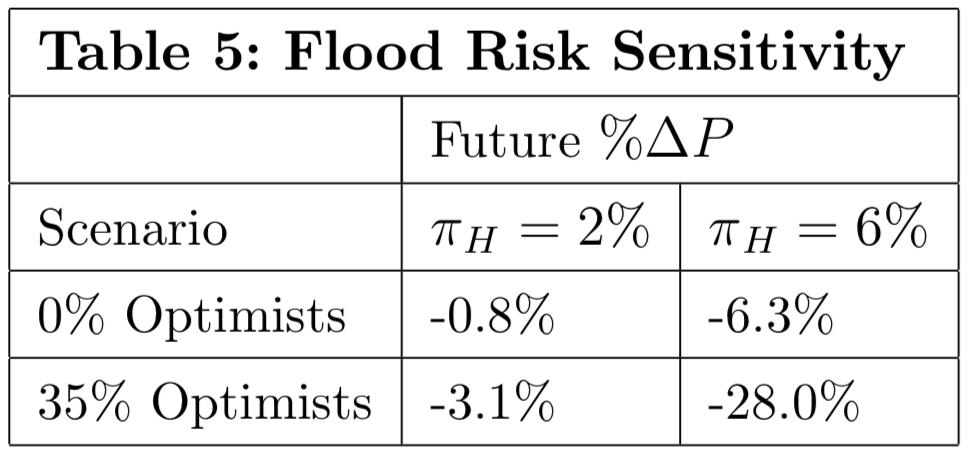

### Predicted flood risk change

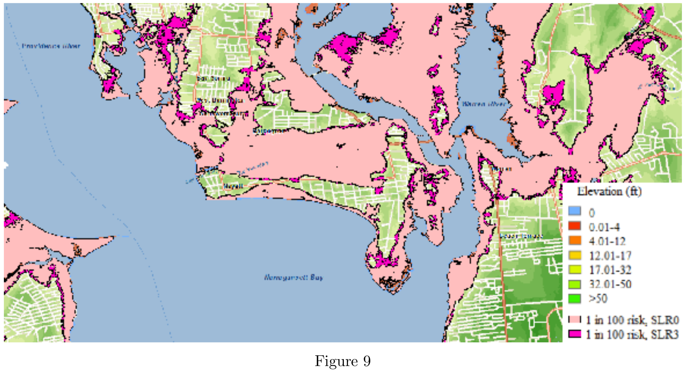

### Predicted flood risk change

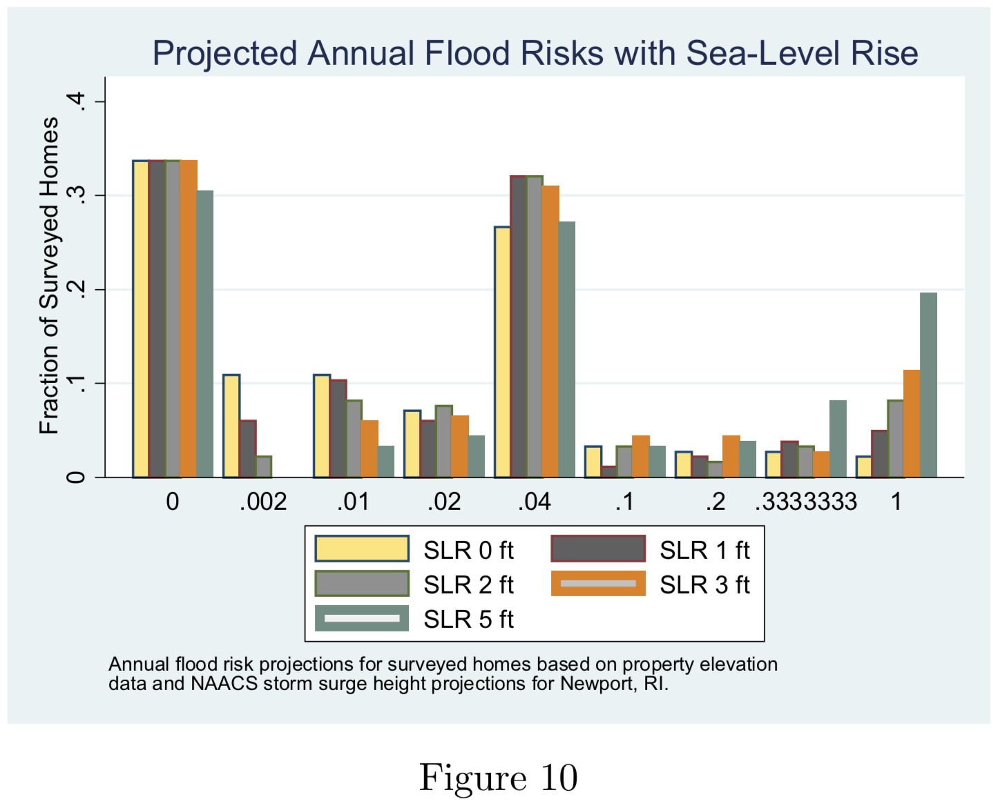
