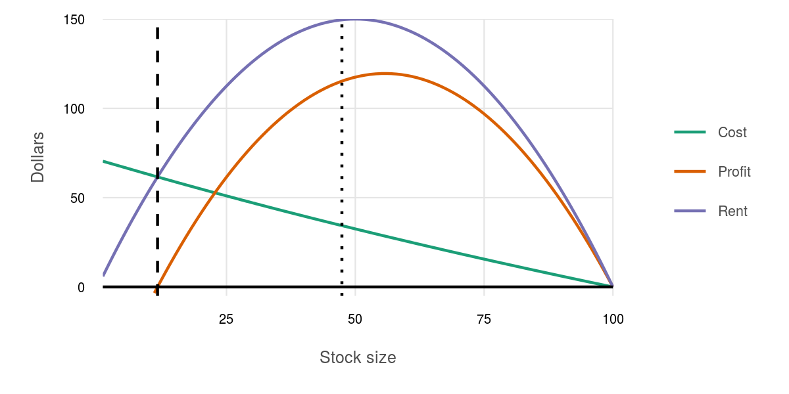
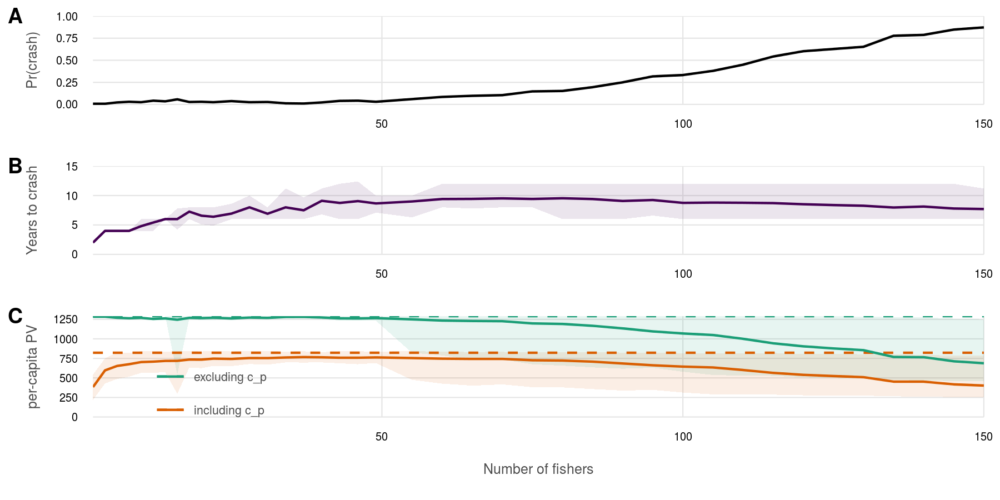

``` {r setup, echo = TRUE, message = FALSE, warning = FALSE}

knitr::opts_chunk$set(fig.width = 6, fig.height = 4, fig.path = 'figs/',
                      echo = TRUE, message = FALSE, warning = FALSE)

source('dpe_fxns.R')

### set up parameters
delta <- .95
r  <- 0.3; K <- 100
TT <- 30
### for payoff function:
p <- 20   ### constant price
B <- 200  ### Unit cost coefficient
payoff_args <- c(p = p, B = B, r = r, K = K)

```


### Calculate optimal harvest and value vectors

These are per-patch values!

``` {r}

x_vec <- 1:K

# n_fishers <- 50
# coll_act_cost <- runif(n = n_fishers, min = b_init/n_fishers, max = b_init) %>%
#   sum() / n_fishers


### optimize_dpe() returns a list of (h_star, v_mat)
opt_fxns <- optimize_dpe(x_vec = x_vec, TT = TT, 
                         payoff_args = payoff_args, 
                         delta = delta, r = r, K = K)
opt_df   <- assemble_df(opt_fxns, x_vec, TT, K)
converged_df  <- opt_df %>%
  filter(t_end == max(t_end)) %>%
  select(x_vec, harvest_opt, value_fn)

### Find optimized e0 value and x1
e_star <- converged_df %>% 
  filter(x_vec == max(x_vec)) %>%
  mutate(e_opt = x_vec - harvest_opt) %>%
  .$e_opt
x_star <- calc_motion(e_star, r, K)

```

``` {r calc open access}

### graph rent and cost at 0.01 resolution
rent_cost_df <- data.frame(x = 1:K) %>%
  mutate(xprime = calc_motion(x, r, K) - x,
         Rent   = xprime * p,
         # Cost   = (r/K) * B * (K - x),
         Cost   = calc_cost(xprime, x, B),
         Profit = Rent - Cost)

### Use a spline interpolation between x values to identify
### best x for rent dissipation.
x_oa <-  spline(rent_cost_df$x, rent_cost_df$Profit, n = 100000) %>%
  as.data.frame() %>%
  mutate(y_abs = abs(y)) %>%      
  filter(x < K/2) %>% 
  filter(y_abs == min(y_abs)) %>%
  .$x

plot_df <- rent_cost_df %>%
  gather(type, value, -x, -xprime)

oa_plot <- ggplot(plot_df, aes(x = x, y = value, color = type)) +
  ggtheme_plot(base_size = 6) +
  geom_line() +
  geom_vline(xintercept = x_oa, linetype = 'dashed') +
  geom_vline(xintercept = e_star, linetype = 'dotted') +
  geom_hline(yintercept = 0) +
  scale_color_brewer(palette = 'Dark2') +
  scale_x_continuous(expand = c(0, 0)) +
  scale_y_continuous(expand = c(0, 0), limits = c(-5, NA)) +
  labs(color = '', x = 'Stock size', y = 'Dollars')
  
ggsave('figs/oa_plot.png', width = 4, height = 2, dpi = 300)

```



``` {r set up fishery parameters and initialize vectors}
### calculate benefit of fishery at optimal management and no poaching
### (starting conditions - single patch)
b_init <- calc_payoff(x_star - e_star, x_star, payoff_args)

n_fishers <- 50 ### fishers in TURF
obs_rate  <- .7 ### chance of getting caught shirking

### initialize sim counts and sim lists
sim_yrs <- 15
sims    <- 400
sims_list <- vector('list', length = sims)
cost_list <- vector('list', length = sims)

```

## Simulations: cost distributions

### Establishing a baseline

Set a cost vector of all fishers exactly at the mean, which should be low enough to avoid any defections.

``` {r set up no poach baseline PV}

set.seed(12345)

cost_dist <- list(dist = 'rtruncnorm', 
                  min = b_init/n_fishers, max = b_init,
                  mean = .35 * (b_init - b_init/n_fishers) + b_init/n_fishers,
                  sd   =   0 * (b_init - b_init/n_fishers))
      
cost_vec <- gen_cost_vec(n = n_fishers, cost_dist)

cost_df <- data.frame(init_cost = cost_vec,
                      sim = 1)

sims_df <- mc_run_sims(cost_df, 1, 
                       replace_dist = cost_dist)
 
pv_base_df <- sims_df %>%
  mutate(discount = delta ^ (year - 1)) %>%
  summarize(`excluding c_p` = sum(profit * discount) / n_fishers,
            `including c_p` = sum((profit - cost_enf) * discount) / n_fishers) %>%
  ungroup() %>%
  gather(type, pcpv_mean)
  
knitr::kable(pv_base_df)
write_csv(pv_base_df, 'data/no_poach_pv.csv')
```

### Uniform cost distribution

``` {r test optimal with collective action cost, eval = FALSE, include = FALSE}
### IDENTICAL: since collective action cost is a constant, it drops out of 
### the maximization 

coll_act_cost <- runif(n = n_fishers, min = b_init/n_fishers, max = b_init) %>%
  sum() / n_fishers

opt_fxns1 <- optimize_dpe(x_vec, TT, payoff_args, delta, r, K, coll_act_cost)
opt_df1   <- assemble_df(opt_fxns1, x_vec, TT, K)
converged_df1  <- opt_df1 %>%
  filter(t_end == max(t_end)) %>%
  select(x_vec, harvest_opt, value_fn)

### Find optimized e0 value and x1
e_star1 <- converged_df1 %>% 
  filter(x_vec == max(x_vec)) %>%
  mutate(e_opt = x_vec - harvest_opt) %>%
  .$e_opt
x_star1 <- calc_motion(e_star1, r, K)
```

``` {r sim uniform distribution}

cost_dist <- list(dist = 'runif', 
                  min = b_init/n_fishers, max = b_init)
  
for(sim in 1:sims) {
  cost_vec <- gen_cost_vec(n = n_fishers, cost_dist)

  cost_list[[sim]] <- data.frame(init_cost = cost_vec,
                                 sim = sim)
}

cost_df <- bind_rows(cost_list)

sims_df <- mc_run_sims(cost_df, sims, 
                       replace_dist = cost_dist)

```

``` {r plot uniform}

unif_plots <- plot_results(sims_df, cost_df)

unif_crash <- calc_yrs_to_crash(sims_df %>% group_by(sim)) %>%
  .$crash_year %>% mean()

```

### Normal cost dist (mid mean)

For this round, the cost distribution is normal, with mean at the center of the potential cost range (from $b > c > b/n$) and standard deviation .25 of the potential cost range: 
$c \sim N \left(\mu = .5(b - b/n) + b/n, \sigma = .25(b - b/n)\right)$

``` {r sim mid normal}
### set up vector of fisher costs to participate:
### b > c > b/n (from Bendor and Mookherjee 1987)
### c ~ normal, mu = .50(b - b/n) + b/n, sigma = .25(b - b/n))$

cost_dist <- list(dist = 'rtruncnorm', 
                  min = b_init/n_fishers, max = b_init,
                  mean = .50 * (b_init - b_init/n_fishers) + b_init/n_fishers,
                  sd   = .25 * (b_init - b_init/n_fishers))
  
for(sim in 1:sims) {
  cost_vec <- gen_cost_vec(n = n_fishers, cost_dist)

  cost_list[[sim]] <- data.frame(init_cost = cost_vec,
                                 sim = sim)
}

cost_df <- bind_rows(cost_list)

sims_df <- mc_run_sims(cost_df, sims, 
                       replace_dist = cost_dist)

```

``` {r plot mid mean normal}

mid_norm_plots <- plot_results(sims_df, cost_df)

mid_norm_crash <- calc_yrs_to_crash(sims_df %>% group_by(sim)) %>%
  .$crash_year %>% mean()
```

### Normal cost dist (low mean)

For this round, the cost distribution is normal, with mean at the 25%ile of the potential cost range (from $b > c > b/n$) and standard deviation .25 of the potential cost range: 
$c \sim N \left(\mu = .35(b - b/n) + b/n, \sigma = .25(b - b/n)\right)$

``` {r sim low normal}

### set up vector of fisher costs to participate:
### b > c > b/n (from Bendor and Mookherjee 1987)

cost_dist <- list(dist = 'rtruncnorm', 
                  min = b_init/n_fishers, max = b_init,
                  mean = .35 * (b_init - b_init/n_fishers) + b_init/n_fishers,
                  sd   = .25 * (b_init - b_init/n_fishers))
  
for(sim in 1:sims) {
  cost_vec <- gen_cost_vec(n = n_fishers, cost_dist)

  cost_list[[sim]] <- data.frame(init_cost = cost_vec,
                                 sim = sim)
}

cost_df <- bind_rows(cost_list)

sims_df <- mc_run_sims(cost_df, sims, 
                       replace_dist = cost_dist)

```

``` {r plot low mean normal}

low_norm_plots <- plot_results(sims_df, cost_df)

low_norm_crash <- calc_yrs_to_crash(sims_df %>% group_by(sim)) %>%
  .$crash_year %>% mean()

```

### Normal cost dist (high mean)

For this round, the cost distribution is normal, with mean at the 75%ile of the potential cost range (from $b > c > b/n$) and standard deviation .25 of the potential cost range: 
$c \sim N \left(\mu = .75(b - b/n) + b/n, \sigma = .25(b - b/n)\right)$

``` {r sim high normal}

### set up vector of fisher costs to participate:
### b > c > b/n (from Bendor and Mookherjee 1987)

cost_dist <- list(dist = 'rtruncnorm', 
                  min = b_init/n_fishers, max = b_init,
                  mean = .75 * (b_init - b_init/n_fishers) + b_init/n_fishers,
                  sd   = .25 * (b_init - b_init/n_fishers))
  
for(sim in 1:sims) {
  cost_vec <- gen_cost_vec(n = n_fishers, cost_dist)

  cost_list[[sim]] <- data.frame(init_cost = cost_vec,
                                 sim = sim)
}

cost_df <- bind_rows(cost_list)

sims_df <- mc_run_sims(cost_df, sims, 
                       replace_dist = cost_dist)

```

``` {r plot high mean normal}

high_norm_plots <- plot_results(sims_df, cost_df)
  
high_norm_crash <- calc_yrs_to_crash(sims_df %>% group_by(sim)) %>%
  .$crash_year %>% mean()

```

### Putting plots together

``` {r effects of dists}

all_rows <- plot_grid(unif_plots, low_norm_plots, mid_norm_plots, high_norm_plots, 
                      nrow = 4, align = 'v', 
                      label_size = 9, labels = LETTERS[1:4])

ggsave('figs/compare_dists.png', width = 6, height = 6, dpi = 300)

years_to_crash <- c(unif = unif_crash, low_norm = low_norm_crash, 
                    mid_norm = mid_norm_crash, high_norm = high_norm_crash)

years_to_crash
write_csv(data.frame(Distribution = c('Uniform', 'Low normal', 
                                      'Mid normal', 'High normal'),
                     `Years to crash` = round(years_to_crash, 2)), 
          'data/years_to_crash.csv')
```


## Simulations: varying parameters

Using a low-mean (normal distribution of cooperation costs, test how crash rates change with number of fishers, observation rate, etc.

Cost distribution is normal, with mean at the 35%ile of the potential cost range (from $b > c > b/n$) and standard deviation .25 of the potential cost range: 
$$c \sim N \left(\mu = .35(b - b/n) + b/n, \sigma = .25(b - b/n)\right)$$
Values outside the range $b > c > b/n$ are truncated to the nearest limit.

Parameters will be varied according to:

* Fishers in TURF:  $n_{fishers} \in [2, 150]$ (above plots based on $n_{fishers} = 50$)
* Observation rate (chance of getting caught shirking): $obs.rate \in [.02, 1.00]$ (above plots based on $obs.rate = .7$)

### Varying number of fishers

To test this, we will generate a new vector of costs for each number of fishers since the distribution parameters are dependent upon the number of fishers in the TURF.  However, as the fishery gets larger, observation of participation becomes more difficult.  This is modeled as $p_{obs} = \min(\frac{k}{n}, p_{obs,max})$; setting $k = p_{obs}n_{fishers} = 0.7 \times 50 = 35$ results in an observation rate that matches prior simulations.  Capping observation rate below 100% allows for imperfect observations even at small numbers of fishers.


``` {r test n_fishers}

n_fishers_vec <- c(seq(2, 20, 2), seq(22, 50, 3), seq(55, 150, 5))
k_obs_rate <- 35
max_obs_rate <- 1.00

crash_vec <- vector(length = length(n_fishers_vec))
sim_by_param_list <- vector('list', length = length(crash_vec))

set.seed(12345)

n_data_file <- 'data/n_harvest_data.csv'

if(!file.exists(n_data_file)) {

  for(i in seq_along(n_fishers_vec)) {
    # i <- 1
    n_fishers <- n_fishers_vec[i]
    obs_rate  <- min(k_obs_rate / n_fishers, max_obs_rate)
    
    cost_dist <- list(dist = 'rtruncnorm', 
                      min = b_init/n_fishers, max = b_init,
                      mean = .35 * (b_init - b_init/n_fishers) + b_init/n_fishers,
                      sd   = .25 * (b_init - b_init/n_fishers))
      
    for(sim in 1:sims) {
      cost_vec <- gen_cost_vec(n = n_fishers, cost_dist)
    
      cost_list[[sim]] <- data.frame(init_cost = cost_vec,
                                     sim = sim)
    }
    
    cost_df <- bind_rows(cost_list)
  
    sims_df <- mc_run_sims(cost_df, sims, 
                           replace_dist = cost_dist) %>%
      mutate(n_fishers = n_fishers,
             obs_rate = obs_rate)
    
    sim_by_param_list[[i]] <- sims_df
  }
  
  sim_by_n_df <- bind_rows(sim_by_param_list)

  n_harvest_df <- sim_by_n_df %>%
    select(sim, year, stock, harvest, shirk, poach, n_fishers)
  n_profit_df <- sim_by_n_df %>%
    select(sim, year, profit, cost_enf, n_fishers)
  write_csv(n_harvest_df, n_data_file)
  write_csv(n_profit_df, str_replace(n_data_file, 'harvest', 'profit'))
  
}

```

``` {r plots for n_fishers}
  
n_harvest_df <- read_csv(n_data_file, col_types = 'iiddddi')
n_profit_df  <- read_csv(str_replace(n_data_file, 'harvest', 'profit'))
  
crash_by_n_df <- n_harvest_df %>%
  filter(year == max(year)) %>%
  group_by(n_fishers) %>%
  summarize(pct_crashes = sum(shirk == 1) / n())

n_plot <- ggplot(crash_by_n_df, aes(x = n_fishers, y = pct_crashes)) +
  ggtheme_plot(base_size = 6) +
  theme(axis.title.x = element_blank()) +
  geom_line() +
  scale_x_continuous(expand = c(0, 0)) +
  scale_y_continuous(expand = c(0, 0), limits = c(0, 1)) +
  labs(x = 'Number of fishers', y = 'Pr(crash)')

  
pv_by_n_df <- n_profit_df %>%
  group_by(sim, n_fishers) %>%
  mutate(discount = delta ^ (year - 1)) %>%
  summarize(`excluding c_p`   = sum(profit * discount) / first(n_fishers),
            `including c_p` = sum((profit - cost_enf) * discount) / first(n_fishers)) %>%
  gather(type, pc_PV, -sim, -n_fishers) %>%
  group_by(type, n_fishers) %>%
  summarize(pcpv_mean = mean(pc_PV),
            pcpv_05 = quantile(pc_PV, .05),
            pcpv_95 = quantile(pc_PV, .95)) %>%
  ungroup()
  
n_pv_plot <- ggplot(pv_by_n_df, aes(x = n_fishers, y = pcpv_mean, color = type)) +
  ggtheme_plot(base_size = 6) +
  theme(legend.position = c(.05, .35)) +
  geom_ribbon(aes(ymax = pcpv_95, ymin = pcpv_05, fill = type), 
              color = NA, alpha = .1, show.legend = FALSE) +
  geom_hline(data = pv_base_df, aes(yintercept = pcpv_mean, color = type), linetype = 'dashed') +
  geom_line(aes(group = type)) +
  scale_color_brewer(palette = 'Dark2') +
  scale_fill_brewer(palette = 'Dark2') +
  scale_x_continuous(expand = c(0, 0)) +
  scale_y_continuous(expand = c(0, 0), limits = c(0, NA)) +
  labs(x = 'Number of fishers', y = 'per-capita PV', color = '')

years_by_n_df <- calc_yrs_to_crash(n_harvest_df %>% group_by(sim, n_fishers)) %>%
  group_by(n_fishers) %>%
  summarize(y2c_mean = mean(crash_year),
            y2c_05 = quantile(crash_year, .05),
            y2c_95 = quantile(crash_year, .95)) %>%
  ungroup()

n_y2c_plot <- ggplot(years_by_n_df, aes(x = n_fishers, y = y2c_mean)) +
  ggtheme_plot(base_size = 6) +
  theme(legend.position = c(.05, .35),  
        axis.title.x = element_blank()) +
  geom_ribbon(aes(ymax = y2c_95, ymin = y2c_05), 
              fill = '#440154',
              color = NA, alpha = .1, show.legend = FALSE) +
  geom_line(color = '#440154') +
  scale_x_continuous(expand = c(0, 0)) +
  scale_y_continuous(expand = c(0, 0), limits = c(0, 15)) +
  labs(x = 'Number of fishers', y = 'Years to crash', color = '')

n_plots <- plot_grid(n_plot, n_y2c_plot, n_pv_plot, 
                     align = 'v', rows = 3, rel_heights = c(3, 3, 4),
                     labels = LETTERS[1:3], label_size = 9)

ggsave(file.path('figs/n_plot.png'), width = 6, height = 3, dpi = 300)

```



### Varying observation rate

To test the effects of observation rate on crash rate, we can generate a single set of cost vectors for the fishers.  We use 50 as the community size.

``` {r fix cost vec}

### Set up the cost vector one time and use for all simulations
n_fishers <- 50 ### default from above

set.seed(12345)

cost_dist <- list(dist = 'rtruncnorm', 
                  min = b_init/n_fishers, max = b_init,
                  mean = .35 * (b_init - b_init/n_fishers) + b_init/n_fishers,
                  sd   = .25 * (b_init - b_init/n_fishers))
  
for(sim in 1:sims) {
  cost_vec <- gen_cost_vec(n = n_fishers, cost_dist)

  cost_list[[sim]] <- data.frame(init_cost = cost_vec,
                                 sim = sim)
}

cost_df <- bind_rows(cost_list)

```

``` {r test obs_rate}

obs_rate_vec <- seq(0.02, 1.00, 0.02)

crash_vec <- vector(length = length(obs_rate_vec))
sim_by_param_list <- vector('list', length = length(crash_vec))

obs_data_file <- 'data/obs_harvest_data.csv'

if(!file.exists(obs_data_file)) {
  for(i in seq_along(obs_rate_vec)) {
    # i <- 1
    obs_rate <- obs_rate_vec[i]
  
    sims_df <- mc_run_sims(cost_df, sims, 
                       replace_dist = cost_dist)
    
    sim_by_param_list[[i]] <- sims_df %>%
      mutate(obs_rate = obs_rate)
  }
  
  sim_by_obs_df <- bind_rows(sim_by_param_list)
  
  obs_harvest_df <- sim_by_obs_df %>%
    select(sim, year, stock, harvest, shirk, poach, obs_rate)
  obs_profit_df <- sim_by_obs_df %>%
    select(sim, year, profit, cost_enf, obs_rate)
  write_csv(obs_harvest_df, obs_data_file)
  write_csv(obs_profit_df, str_replace(obs_data_file, 'harvest', 'profit'))
  
}

```

``` {r plot obs rate}

obs_harvest_df <- read_csv(obs_data_file, col_types = 'iiddddd')
obs_profit_df  <- read_csv(str_replace(obs_data_file, 'harvest', 'profit'))
  
crash_by_obs_df <- obs_harvest_df %>%
  filter(year == max(year)) %>%
  group_by(obs_rate) %>%
  summarize(pct_crashes = sum(shirk == 1) / n())

obs_plot <- ggplot(crash_by_obs_df, aes(x = obs_rate, y = pct_crashes)) +
  ggtheme_plot(base_size = 6) +
  theme(axis.title.x = element_blank()) +
  geom_line() +
  scale_x_continuous(expand = c(0, 0)) +
  scale_y_continuous(expand = c(0, 0), limits = c(0, 1)) +
  labs(x = 'Observation rate', y = 'Pr(crash)')

pv_by_obs_df <- obs_profit_df %>%
  group_by(sim, obs_rate) %>%
  mutate(discount = delta ^ (year - 1)) %>%
  summarize(`excluding c_p`   = sum(profit * discount) / first(n_fishers),
            `including c_p` = sum((profit - cost_enf) * discount) / first(n_fishers)) %>%
  gather(type, pc_PV, -sim, -obs_rate) %>%
  group_by(type, obs_rate) %>%
  summarize(pcpv_mean = mean(pc_PV),
            pcpv_05 = quantile(pc_PV, .05),
            pcpv_95 = quantile(pc_PV, .95)) %>%
  ungroup()
  
obs_pv_plot <- ggplot(pv_by_obs_df, aes(x = obs_rate, y = pcpv_mean, color = type)) +
  ggtheme_plot(base_size = 6) +
  theme(legend.position = c(.7, .35)) +
  geom_ribbon(aes(ymax = pcpv_95, ymin = pcpv_05, fill = type), 
              color = NA, alpha = .1, show.legend = FALSE) +
  geom_hline(data = pv_base_df, aes(yintercept = pcpv_mean, color = type), linetype = 'dashed') +
  geom_line(aes(group = type)) +
  scale_color_brewer(palette = 'Dark2') +
  scale_fill_brewer(palette = 'Dark2') +
  scale_x_continuous(expand = c(0, 0)) +
  scale_y_continuous(expand = c(0, 0), limits = c(0, NA)) +
  labs(x = 'Observation rate', y = 'per-capita PV', color = '')

years_by_obs_df <- calc_yrs_to_crash(obs_harvest_df %>% group_by(sim, obs_rate)) %>%
  group_by(obs_rate) %>%
  summarize(y2c_mean = mean(crash_year),
            y2c_05 = quantile(crash_year, .05),
            y2c_95 = quantile(crash_year, .95)) %>%
  ungroup()

obs_y2c_plot <- ggplot(years_by_obs_df, aes(x = obs_rate, y = y2c_mean)) +
  ggtheme_plot(base_size = 6) +
  theme(legend.position = c(.05, .35),
        axis.title.x = element_blank()) +
  geom_ribbon(aes(ymax = y2c_95, ymin = y2c_05), 
              fill = '#440154',
              color = NA, alpha = .1, show.legend = FALSE) +
  geom_line(color = '#440154') +
  scale_x_continuous(expand = c(0, 0)) +
  scale_y_continuous(expand = c(0, 0), limits = c(0, 15)) +
  labs(x = 'Observation rate', y = 'Years to crash', color = '')

obs_plots <- plot_grid(obs_plot, obs_y2c_plot, obs_pv_plot, 
                       align = 'v', rows = 3, rel_heights = c(3, 3, 4),
                       labels = LETTERS[1:3], label_size = 9)

ggsave(file.path('figs/obs_plot.png'), width = 6, height = 3, dpi = 300)
```


### Varying spread of inequality

To test the effects of the spread of inequality on crash rate (i.e. change the variance on the distribution of costs while leaving the mean in place), we must generate a set of cost vectors for the fishers for different variance levels.  We use 50 as the community size.

``` {r test cost variance}

n_fishers <- 50 ### default from above
obs_rate  <- 0.70
sd_vec <- c(seq(0.02, .30, .02), seq(.35, 1.00, 0.05))

crash_vec <- vector(length = length(sd_vec))
sim_by_param_list <- vector('list', length = length(crash_vec))

sd_data_file <- 'data/sd_harvest_data.csv'

if(!file.exists(sd_data_file)) {
  for(i in seq_along(sd_vec)) {
    # i <- 1
    ### Set up the cost vector one time and use for all simulations
  
    set.seed(12345)
    cost_var <- sd_vec[i]
    
    cost_dist <- list(dist = 'rtruncnorm', 
                      min = b_init/n_fishers, max = b_init,
                      mean = .35 * (b_init - b_init/n_fishers) + b_init/n_fishers,
                      sd   = cost_var * (b_init - b_init/n_fishers))
      
    for(sim in 1:sims) {
      cost_vec <- gen_cost_vec(n = n_fishers, cost_dist)
    
      cost_list[[sim]] <- data.frame(init_cost = cost_vec,
                                     sim = sim)
    }
    
    cost_df <- bind_rows(cost_list)
  
    sims_df <- mc_run_sims(cost_df, sims, 
                       replace_dist = cost_dist)
    
    sim_by_param_list[[i]] <- sims_df %>%
      mutate(cost_var = cost_var)
  }
  
  sim_by_sd_df <- bind_rows(sim_by_param_list)

  sd_harvest_df <- sim_by_sd_df %>%
    select(sim, year, stock, harvest, shirk, poach, cost_var)
  sd_profit_df <- sim_by_sd_df %>%
    select(sim, year, profit, cost_enf, cost_var)
  write_csv(sd_harvest_df, sd_data_file)
  write_csv(sd_profit_df, str_replace(sd_data_file, 'harvest', 'profit'))
  
}
```

``` {r sd_plots}
  
sd_harvest_df <- read_csv(sd_data_file, col_types = 'iiddddd')
sd_profit_df <- read_csv(str_replace(sd_data_file, 'harvest', 'profit'))
  
crash_by_sd_df <- sd_harvest_df %>%
  filter(year == max(year)) %>%
  group_by(cost_var) %>%
  summarize(pct_crashes = sum(shirk == 1) / n())

sd_plot <- ggplot(crash_by_sd_df, aes(x = cost_var, y = pct_crashes)) +
  ggtheme_plot(base_size = 6) +
  theme(axis.title.x = element_blank()) +
  geom_line() +
  scale_x_continuous(expand = c(0, 0)) +
  scale_y_continuous(expand = c(0, 0), limits = c(0, 1)) +
  labs(x = 'relative SD(cost)', y = 'Pr(crash)')


pv_by_sd_df <- sd_profit_df %>%
  group_by(sim, cost_var) %>%
  mutate(discount = delta ^ (year - 1)) %>%
  summarize(`excluding c_p`   = sum(profit * discount) / first(n_fishers),
            `including c_p` = sum((profit - cost_enf) * discount) / first(n_fishers)) %>%
  gather(type, pc_PV, -sim, -cost_var) %>%
  group_by(type, cost_var) %>%
  summarize(pcpv_mean = mean(pc_PV),
            pcpv_05 = quantile(pc_PV, .05),
            pcpv_95 = quantile(pc_PV, .95)) %>%
  ungroup()
  
sd_pv_plot <- ggplot(pv_by_sd_df, aes(x = cost_var, y = pcpv_mean, color = type)) +
  ggtheme_plot(base_size = 6) +
  theme(legend.position = c(.05, .35)) +
  geom_ribbon(aes(ymax = pcpv_95, ymin = pcpv_05, fill = type), 
              color = NA, alpha = .1, show.legend = FALSE) +
  geom_hline(data = pv_base_df, aes(yintercept = pcpv_mean, color = type), linetype = 'dashed') +
  geom_line(aes(group = type)) +
  scale_color_brewer(palette = 'Dark2') +
  scale_fill_brewer(palette = 'Dark2') +
  scale_x_continuous(expand = c(0, 0)) +
  scale_y_continuous(expand = c(0, 0), limits = c(0, NA)) +
  labs(x = 'Rel SD(participation cost)', y = 'per-capita PV', color = '')

years_by_sd_df <- calc_yrs_to_crash(sd_harvest_df %>% group_by(sim, cost_var)) %>%
  group_by(cost_var) %>%
  summarize(y2c_mean = mean(crash_year),
            y2c_05 = quantile(crash_year, .05),
            y2c_95 = quantile(crash_year, .95)) %>%
  ungroup()

sd_y2c_plot <- ggplot(years_by_sd_df, aes(x = cost_var, y = y2c_mean)) +
  ggtheme_plot(base_size = 6) +
  theme(legend.position = c(.05, .35),
        axis.title.x = element_blank()) +
  geom_ribbon(aes(ymax = y2c_95, ymin = y2c_05), 
              fill = '#440154',
              color = NA, alpha = .1, show.legend = FALSE) +
  geom_line(color = '#440154') +
  scale_x_continuous(expand = c(0, 0)) +
  scale_y_continuous(expand = c(0, 0), limits = c(0, 15)) +
  labs(x = 'Rel SD(participation cost)', y = 'Years to crash', color = '')

sd_plots <- plot_grid(sd_plot, sd_y2c_plot, sd_pv_plot, 
                      align = 'v', rows = 3, rel_heights = c(3, 3, 4),
                      labels = LETTERS[1:3], label_size = 9)

ggsave(file.path('figs/sd_plot.png'), width = 6, height = 3, dpi = 300)

```


## Extensions

### Aging out of fishery

What if fishers aged out of the fishery?  Fishers enter the fishery at some distribution of ages (say 18-35) and age out at some point (say 55) to be replaced by a young fisher (say 18-25).

For a non-aging model, high cost fishers are likely to get kicked out and replaced with low cost fishers, eventually resulting in a stable state at which all fishers are low cost, at which point the fishery returns to its optimal long-term harvest.

However, aging provides a mechanism for a low-cost fisher to age out, only to be potentially replaced with a high cost fisher.  If the rate of age replacement (potentially replacing low-cost fisher) is comparable to the rate of expulsion replacement (potentially replacing high-cost fisher), can the fishery maintain stability?  What if participation cost changed with the age of the fisher (e.g. more experience = lower cost, or lower will to participate)?

### Resilience to instability in catch

Consider a stochastic term on the growth rate of the stock.  How resilient is the community to this stochasticity, if low harvests are likely to lead to lack of cooperation in the subsequent period?

### Variants on decision to shirk

Allow fishers to more cautiously consider decisions to shirk.  Examples: 

* For each period in which the benefit to shirking outweighs the benefit to cooperate, perhaps there is only a probability, rather than a certainty, that the fisher will choose to shirk.
* Potential shirkers will reconsider their decision if the following year is good.  In other words, it takes two successive bad years before the fisher follows through on shirking.

