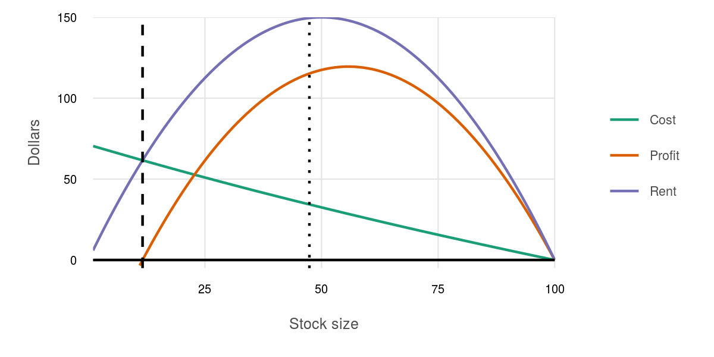
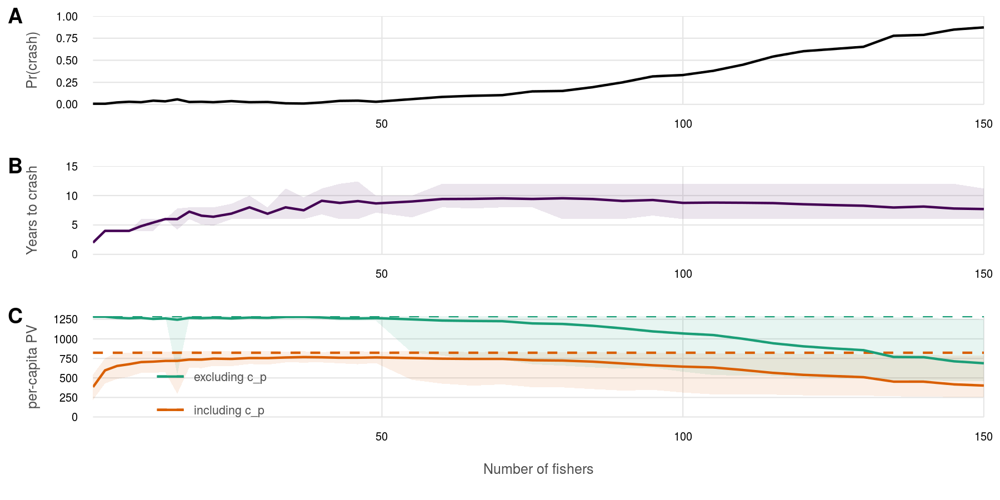
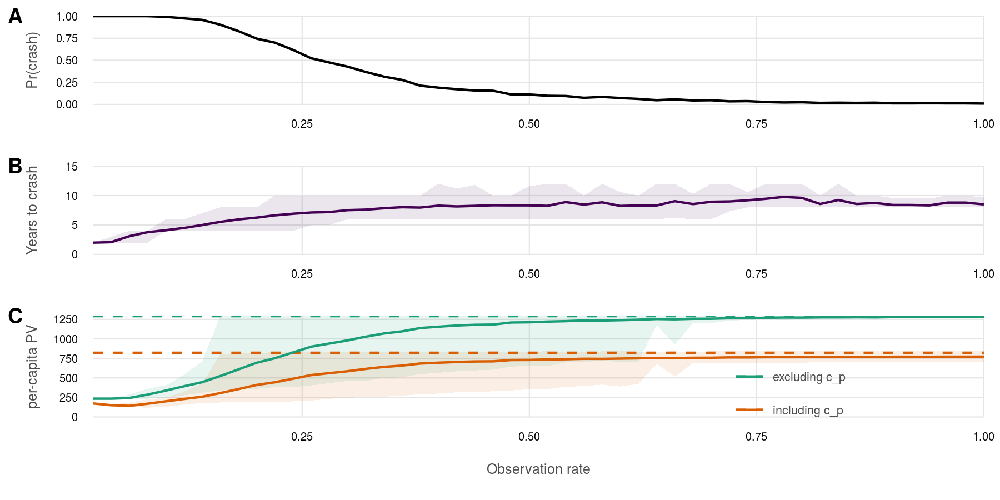
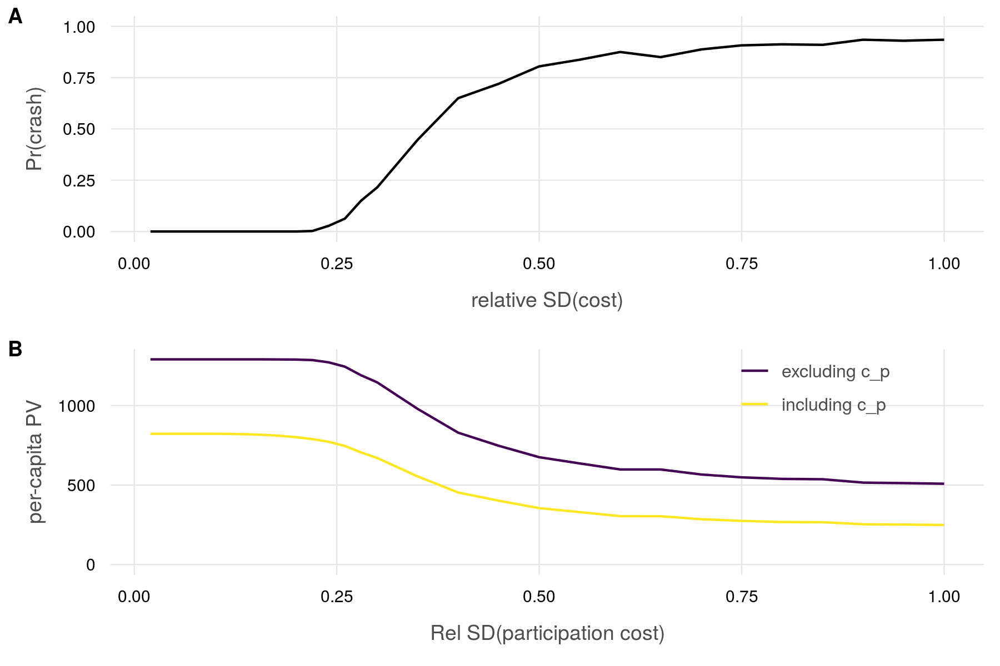

# Econ 260A: Project writeup

## Modeling benefit from a TURF with a collective action public good

TURF provides a benefit over an open access condition by managing harvests to an optimal residual stock each time period.  TURF members participate in the provision of a public good above and beyond the fishery benefit.  For example, members participate in a monitoring/enforcement system in which full participation prevents any poaching.

### Fishery model

Each fisher is equally skilled at fishing (equal costs), and all fishers share profits from the fishery, so all benefit equally from the harvest itself.  This uniform benefit assumption may be relaxed later.

Each period, the fishers harvest down to the time-independent optimal residual stock $y^* = x_t - h_t^*$ determined based on an assumption of complete cooperation (i.e. no poaching).  Poaching, if any, occurs after harvest but before growth of the stock.  The stock redistributes uniformly throughout the $n$ plots after poaching but prior to growth.  Growth is assumed to be deterministic, for now: $x_{t+1} = x_t + G(x_t - h_t^* - p_t)$.  

The base model will follow Clark (1973):

* Growth function is logistic: $dx/dt = Ax(K - x) \Rightarrow x_{t+1} = x_t(1 + A(K - x))$ where $A = r/K$.
* Price is constant $p$; rent $R = ph_t$.
* Cost is inversely related to stock size.
    * thus total cost to harvest $C \approx By/x = AB(K - x)$ where $B$ is the unit cost coefficient.  
    * Approximation, because it would actually be an integral over the stock from $x_t$ to $x_t - h_t$.
    * Coded as $\int_{x-h}^x \frac{B}{x} dx$

### Poaching model

The total TURF is divided into $n$ equal plots, with uniform distribution of the stock across all plots.  Each participant in the collective action prevents poaching from one plot; full participation prevents all poaching.  Any shirking member will enable poaching from one plot.  Poaching in a plot will remove all existing stock down to the open access level for that plot.  Since initial stock and harvest are uniform across all plots, an unpoached plot, going into the growth phase, will have a residual stock of $y^*/n$, while a poached plot will have a residual stock of $y_{oa}/n$.

For enforcement rate $\eta_t$, pre-poaching residual stock $y_t = y^*$, and open-access residual stock $y_{OA}$, total residual stock after poaching is:
$$y_{p,t} = \eta_t y^* + (1 - \eta_t)y_{oa}$$
and poaching in time $t$ across all plots in the TURF is:
$$\rho_t = y^* - y_{p,t} = (1 - \eta_t)(y^* - y_{oa})$$

### Participation model

Participation in the fishery includes responsibilities to participate in the collective action provision of public good.  

While all members are equally skilled at fishing, each member may bear a different cost $c_i$ of participating in the collective action, for example differences in opportunity cost of time spent patrolling.  These costs to individual fishers are independent of harvest and stock, and are initially randomly drawn from some distribution $f$.

Fishers will compare the long-term benefits from participating in the TURF with the costs of contributing to the public good.  If every fisher participates in collective enforcement, then the total benefit to the TURF in each period is simply the profit of the TURF over an open access situation, which is simply the profit of the TURF (since open access profits devolve to zero).  

The per-participant contribution to the benefit is $b_t = \pi_t(h_t)/n$.  If all other members are cooperating, the benefit to the $i$th member of cooperation is $b_t - c_i$; if the $i$th member chooses to defect, he will earn a one-time defection premium of $c_i - b_t/n$ but risk expulsion, and loss of all future benefits.  To ensure a prisoner's dilemma, $b_t > c_i > b_t/n$.  If participants are observed completely (100% chance of expulsion), then the future stream of benefits from cooperation must exceed the defection premium to ensure cooperation, otherwise the member will forego future benefits and not contribute to the public good; under imperfect observation, potential foregone future benefits are reduced further:

$$p_{obs} \times\frac{\delta}{1 - \delta} (b_t - c_i) > c_i - b_t/n$$

Shirkers, if caught, are expelled from the fishery and replaced with a new member from outside the current fishery, whose cost of participation is also drawn from distribution $f$.  Over time, this will change the distribution of participation costs within the fishery as higher-cost participants are expelled and often replaced with lower-cost participants.

### Open access equilibrium

From the Clark model, open access equilibrium occurs when rent is fully dissipated, i.e.:
\begin{align*}
  R - C &= pAx(K-x) - AB(K-x) = 0\\
    &= pKx - px^2 - BK + Bx = 0\\
    &= px^2 - (pK + B)x + BK = 0\\
  \Longrightarrow x_{OA} &= \frac{(pK + B) \pm \sqrt{(pK + B)^2 - 4pBK}}{2p}
\end{align*}
Solving numerically, using $C = \int_{x-h}^x \frac{B}{x}dx$, we can identify more accurately the stock level where $R - C \approx 0$.

``` {r setup, echo = TRUE, message = FALSE, warning = FALSE, include = FALSE}

knitr::opts_chunk$set(fig.width = 6, fig.height = 4, fig.path = 'figs/',
                      echo = FALSE, message = FALSE, warning = FALSE)

source('dpe_fxns.R')

### set up parameters
delta <- .9
r  <- 0.3; K <- 100
TT <- 30
### for payoff function:
p <- 20   ### constant price
B <- 200  ### Unit cost coefficient
payoff_args <- c(p = p, B = B, r = r, K = K)

```

``` {r calc open access}

### graph rent and cost at 0.01 resolution
rent_cost_df <- data.frame(x = 1:K) %>%
  mutate(xprime = calc_motion(x, r, K) - x,
         Rent   = xprime * p,
         # Cost   = (r/K) * B * (K - x),
         Cost   = calc_cost(xprime, x, B),
         Profit = Rent - Cost)

### Use a spline interpolation between x values to identify
### best x for rent dissipation.
x_oa <-  spline(rent_cost_df$x, rent_cost_df$Profit, n = 100000) %>%
  as.data.frame() %>%
  mutate(y_abs = abs(y)) %>%      
  filter(x < K/2) %>% 
  filter(y_abs == min(y_abs)) %>%
  .$x

plot_df <- rent_cost_df %>%
  gather(type, value, -x, -xprime)

oa_plot <- ggplot(plot_df, aes(x = x, y = value, color = type)) +
  ggtheme_plot() +
  geom_line() +
  geom_vline(xintercept = x_oa, linetype = 'dashed') +
  geom_hline(yintercept = 0) +
  ylim(c(-5, NA)) +
  labs(color = '', x = 'Stock size (N)', y = 'Dollars')
  
ggsave('figs/oa_plot.png', width = 6, height = 4, dpi = 300)

```



### Calculate optimal harvest and value vectors

``` {r}

x_vec <- 1:K

### optimize_dpe() returns a list of (h_star, v_mat)
opt_fxns <- optimize_dpe(x_vec, TT, payoff_args, delta, r, K)
opt_df   <- assemble_df(opt_fxns, x_vec, TT, K)
converged_df  <- opt_df %>%
  filter(t_end == max(t_end)) %>%
  select(x_vec, harvest_opt, value_fn)

### Find optimized y0 value and x1
ystar <- converged_df %>% 
  filter(x_vec == max(x_vec)) %>%
  mutate(y_opt = x_vec - harvest_opt) %>%
  .$y_opt
xstar <- calc_motion(ystar, r, K)

```

``` {r set up fishery parameters and initialize vectors}
### calculate benefit of fishery at optimal management and no poaching
### (starting conditions)
b_init <- calc_payoff(xstar - ystar, xstar, payoff_args)

n_fishers <- 50 ### fishers in TURF
obs_rate  <- .7 ### chance of getting caught shirking

### initialize sim counts and sim lists
sim_yrs <- 15
sims    <- 400
sims_list <- vector('list', length = sims)
cost_list <- vector('list', length = sims)

```

## Simulations: cost distributions

### Uniform cost distribution

``` {r sim uniform distribution}

for(sim in 1:sims) {
  ### set up vector of fisher costs to participate:
  ### b > c > b/n (from Bendor and Mookherjee 1987)
  ### use random uniform
  cost_vec <- runif(n = n_fishers, min = b_init/n_fishers, max = b_init)

  cost_list[[sim]] <- data.frame(init_cost = cost_vec,
                                 sim = sim)
}

cost_df <- bind_rows(cost_list)

sims_df <- mc_run_sims(cost_df, sims)

```

#### plots: uniform cost distribution

``` {r plot uniform}

plot_results(sims_df, cost_df)

```

### Normal cost dist (mid mean)

For this round, the cost distribution is normal, with mean at the center of the potential cost range (from $b > c > b/n$) and standard deviation .25 of the potential cost range: 
$c \sim N \left(\mu = .5(b - b/n) + b/n, \sigma = .25(b - b/n)\right)$

``` {r sim mid normal}

for(sim in 1:sims) {
  ### set up vector of fisher costs to participate:
  ### b > c > b/n (from Bendor and Mookherjee 1987)
  ### c ~ normal, mu = .50(b - b/n) + b/n, sigma = .25(b - b/n))$
  mu  <- .50 * (b_init - b_init/n_fishers) + b_init/n_fishers
  sig <- .25 * (b_init - b_init/n_fishers)
  cost_vec <- rnorm(n = n_fishers, mean = mu, sd = sig)
  cost_vec[cost_vec < b_init/n_fishers] <- b_init/n_fishers
  cost_vec[cost_vec > b_init] <- b_init

  cost_list[[sim]] <- data.frame(init_cost = cost_vec,
                                 sim = sim)
}

cost_df <- bind_rows(cost_list)

sims_df <- mc_run_sims(cost_df, sims)

```

#### plots: normal (mid mean) cost distribution

``` {r plot mid mean normal}

plot_results(sims_df, cost_df)

```

### Normal cost dist (low mean)

For this round, the cost distribution is normal, with mean at the 25%ile of the potential cost range (from $b > c > b/n$) and standard deviation .25 of the potential cost range: 
$c \sim N \left(\mu = .35(b - b/n) + b/n, \sigma = .25(b - b/n)\right)$

``` {r sim low normal}

for(sim in 1:sims) {
  ### set up vector of fisher costs to participate:
  ### b > c > b/n (from Bendor and Mookherjee 1987)
  ### c ~ normal, mu = .25(b - b/n) + b/n, sigma = .25(b - b/n)$
  mu  <- .35 * (b_init - b_init/n_fishers) + b_init/n_fishers
  sig <- .25 * (b_init - b_init/n_fishers)
  cost_vec <- rnorm(n = n_fishers, mean = mu, sd = sig)
  cost_vec[cost_vec < b_init/n_fishers] <- b_init/n_fishers
  cost_vec[cost_vec > b_init] <- b_init

  cost_list[[sim]] <- data.frame(init_cost = cost_vec,
                                 sim = sim)
}

cost_df <- bind_rows(cost_list)

sims_df <- mc_run_sims(cost_df, sims)

```

#### plots: normal (low mean) cost distribution

``` {r plot low mean normal}

plot_results(sims_df, cost_df)

```

### Normal cost dist (high mean)

For this round, the cost distribution is normal, with mean at the 75%ile of the potential cost range (from $b > c > b/n$) and standard deviation .25 of the potential cost range: 
$c \sim N \left(\mu = .75(b - b/n) + b/n, \sigma = .25(b - b/n)\right)$

``` {r sim high normal}

for(sim in 1:sims) {
  ### set up vector of fisher costs to participate:
  ### b > c > b/n (from Bendor and Mookherjee 1987)
  ### c ~ normal, mu = .75(b - b/n) + b/n, sigma = .25(b - b/n)
  mu  <- .75 * (b_init - b_init/n_fishers) + b_init/n_fishers
  sig <- .25 * (b_init - b_init/n_fishers)
  cost_vec <- rnorm(n = n_fishers, mean = mu, sd = sig)
  cost_vec[cost_vec < b_init/n_fishers] <- b_init/n_fishers
  cost_vec[cost_vec > b_init] <- b_init

  cost_list[[sim]] <- data.frame(init_cost = cost_vec,
                                 sim = sim)
}

cost_df <- bind_rows(cost_list)

sims_df <- mc_run_sims(cost_df, sims)

```

#### plots: normal (low mean) cost distribution

``` {r plot high mean normal}

plot_results(sims_df, cost_df)
  
```


## Simulations: varying parameters

Using a low-mean (normal distribution of cooperation costs, test how crash rates change with number of fishers, observation rate, etc.

Cost distribution is normal, with mean at the 35%ile of the potential cost range (from $b > c > b/n$) and standard deviation .25 of the potential cost range: 
$$c \sim N \left(\mu = .35(b - b/n) + b/n, \sigma = .25(b - b/n)\right)$$
Values outside the range $b > c > b/n$ are truncated to the nearest limit.

Parameters will be varied according to:

* Fishers in TURF:  $n_{fishers} \in [2, 150]$ (above plots based on $n_{fishers} = 50$)
* Observation rate (chance of getting caught shirking): $obs.rate \in [.02, 1.00]$ (above plots based on $obs.rate = .7$)

### Varying number of fishers

To test this, we will generate a new vector of costs for each number of fishers since the distribution parameters are dependent upon the number of fishers in the TURF.  However, as the fishery gets larger, observation of participation becomes more difficult.  This is modeled as $p_{obs} = \min(\frac{k}{n}, p_{obs,max})$; setting $k = p_{obs}n_{fishers} = 0.7 \times 50 = 35$ results in an observation rate that matches prior simulations.  Capping observation rate below 100% allows for imperfect observations even at small numbers of fishers.


``` {r test n_fishers}

n_fishers_vec <- c(seq(2, 20, 2), seq(22, 50, 3), seq(55, 150, 5))
k_obs_rate <- 35
max_obs_rate <- 1.00

crash_vec <- vector(length = length(n_fishers_vec))
sim_by_param_list <- vector('list', length = length(crash_vec))

set.seed(1234)

n_data_file <- 'data/n_data.csv'

if(!file.exists(n_data_file)) {

  for(i in seq_along(n_fishers_vec)) {
    # i <- 1
    n_fishers <- n_fishers_vec[i]
    obs_rate  <- min(k_obs_rate / n_fishers, max_obs_rate)
    
    for(sim in 1:sims) {
      ### set up vector of fisher costs to participate:
      ### b > c > b/n (from Bendor and Mookherjee 1987)
      ### c ~ normal, mu = .25(b - b/n) + b/n, sigma = .25(b - b/n)$
      mu  <- .35 * (b_init - b_init/n_fishers) + b_init/n_fishers
      sig <- .25 * (b_init - b_init/n_fishers)
      cost_vec <- rnorm(n = n_fishers, mean = mu, sd = sig)
      cost_vec[cost_vec < b_init/n_fishers] <- b_init/n_fishers
      cost_vec[cost_vec > b_init] <- b_init
    
      cost_list[[sim]] <- data.frame(init_cost = cost_vec,
                                     sim = sim)
    }
    
    cost_df <- bind_rows(cost_list)
  
    sims_df <- mc_run_sims(cost_df, sims)
    
    sim_by_param_list[[i]] <- sims_df %>%
      mutate(n_fishers = n_fishers,
             obs_rate = obs_rate)
  }
  
  sim_by_n_df <- bind_rows(sim_by_param_list)

  write_csv(sim_by_n_df, n_data_file)
  
} else {
  
  sim_by_n_df <- read_csv(n_data_file, col_types = 'iddddidid')
  
}


crash_by_n_df <- sim_by_n_df %>%
  filter(year == max(year)) %>%
  group_by(n_fishers) %>%
  summarize(pct_crashes = sum(shirk == 1) / n())

n_plot <- ggplot(crash_by_n_df, aes(x = n_fishers, y = pct_crashes)) +
  ggtheme_plot() +
  geom_line()

ggsave(file.path('figs/n_plot.png'), width = 6, height = 4, dpi = 300)

```



### Varying observation rate

To test the effects of observation rate on crash rate, we can generate a single set of cost vectors for the fishers.  We use 50 as the community size.

``` {r fix cost vec}

### Set up the cost vector one time and use for all simulations
n_fishers <- 50 ### default from above

set.seed(1234)

for(sim in 1:sims) {
  ### set up vector of fisher costs to participate:
  ### b > c > b/n (from Bendor and Mookherjee 1987)
  ### c ~ normal, mu = .25(b - b/n) + b/n, sigma = .25(b - b/n)$
  mu  <- .35 * (b_init - b_init/n_fishers) + b_init/n_fishers
  sig <- .25 * (b_init - b_init/n_fishers)
  cost_vec <- rnorm(n = n_fishers, mean = mu, sd = sig)
  cost_vec[cost_vec < b_init/n_fishers] <- b_init/n_fishers
  cost_vec[cost_vec > b_init] <- b_init

  cost_list[[sim]] <- data.frame(init_cost = cost_vec,
                                 sim = sim)
}

cost_df <- bind_rows(cost_list)

```

``` {r test obs_rate}

obs_rate_vec <- seq(0.02, 1.00, 0.02)

crash_vec <- vector(length = length(obs_rate_vec))
sim_by_param_list <- vector('list', length = length(crash_vec))

obs_data_file <- 'data/obs_data.csv'

if(!file.exists(obs_data_file)) {
  for(i in seq_along(obs_rate_vec)) {
    # i <- 1
    obs_rate <- obs_rate_vec[i]
  
    sims_df <- mc_run_sims(cost_df, sims)
    
    sim_by_param_list[[i]] <- sims_df %>%
      mutate(obs_rate = obs_rate)
  }
  
  sim_by_obs_df <- bind_rows(sim_by_param_list)
  write_csv(sim_by_obs_df, obs_data_file)
} else {
  sim_by_obs_df <- read_csv(obs_data_file, col_types = 'iddddidd')
}


crash_by_obs_df <- sim_by_obs_df %>%
  filter(year == max(year)) %>%
  group_by(obs_rate) %>%
  summarize(pct_crashes = sum(shirk == 1) / n())

obs_plot <- ggplot(crash_by_obs_df, aes(x = obs_rate, y = pct_crashes)) +
  ggtheme_plot() +
  geom_line()

ggsave(file.path('figs/obs_plot.png'), width = 6, height = 4, dpi = 300)
```



### Varying spread of inequality

To test the effects of the spread of inequality on crash rate (i.e. change the variance on the distribution of costs while leaving the mean in place), we must generate a set of cost vectors for the fishers for different variance levels.  We use 50 as the community size.

``` {r test cost variance}

n_fishers <- 50 ### default from above
obs_rate  <- 0.70
var_vec <- c(seq(0.02, .30, .02), seq(.35, 1.00, 0.05))

crash_vec <- vector(length = length(var_vec))
sim_by_param_list <- vector('list', length = length(crash_vec))

var_data_file <- 'data/var_data.csv'

if(!file.exists(var_data_file)) {
  for(i in seq_along(var_vec)) {
    # i <- 1
    ### Set up the cost vector one time and use for all simulations
  
    set.seed(1234)
    cost_var <- var_vec[i]
    
    for(sim in 1:sims) {
      ### set up vector of fisher costs to participate:
      ### b > c > b/n (from Bendor and Mookherjee 1987)
      ### c ~ normal, mu = .25(b - b/n) + b/n, sigma = .25(b - b/n)$
      mu  <- .35 * (b_init - b_init/n_fishers) + b_init/n_fishers
      sig <- cost_var * (b_init - b_init/n_fishers)
      cost_vec <- rnorm(n = n_fishers, mean = mu, sd = sig)
      cost_vec[cost_vec < b_init/n_fishers] <- b_init/n_fishers
      cost_vec[cost_vec > b_init] <- b_init
    
      cost_list[[sim]] <- data.frame(init_cost = cost_vec,
                                     sim = sim)
    }
    
    cost_df <- bind_rows(cost_list)
  
    sims_df <- mc_run_sims(cost_df, sims)
    
    sim_by_param_list[[i]] <- sims_df %>%
      mutate(cost_var = cost_var)
  }
  
  sim_by_var_df <- bind_rows(sim_by_param_list)

  write_csv(sim_by_var_df, var_data_file)
} else {
  sim_by_var_df <- read_csv(var_data_file, col_types = 'iddddidd')
}


crash_by_var_df <- sim_by_var_df %>%
  filter(year == max(year)) %>%
  group_by(cost_var) %>%
  summarize(pct_crashes = sum(shirk == 1) / n())


var_plot <- ggplot(crash_by_var_df, aes(x = cost_var, y = pct_crashes)) +
  ggtheme_plot() +
  geom_line()

ggsave(file.path('figs/var_plot.png'), width = 6, height = 4, dpi = 300)

```



## Extensions

### Aging out of fishery

What if fishers aged out of the fishery?  Fishers enter the fishery at some distribution of ages (say 18-35) and age out at some point (say 55) to be replaced by a young fisher (say 18-25).

For a non-aging model, high cost fishers are likely to get kicked out and replaced with low cost fishers, eventually resulting in a stable state at which all fishers are low cost, at which point the fishery returns to its optimal long-term harvest.

However, aging provides a mechanism for a low-cost fisher to age out, only to be potentially replaced with a high cost fisher.  If the rate of age replacement (potentially replacing low-cost fisher) is comparable to the rate of expulsion replacement (potentially replacing high-cost fisher), can the fishery maintain stability?

### Resilience to instability in catch

Consider a stochastic term on the growth rate of the stock.  How resilient is the community to this stochasticity, if low harvests are likely to lead to lack of cooperation in the subsequent period?

### Variants on decision to shirk

Allow fishers to more cautiously consider decisions to shirk.  Examples: 

* For each period in which the benefit to shirking outweighs the benefit to cooperate, perhaps there is only a probability, rather than a certainty, that the fisher will choose to shirk.
* Potential shirkers will reconsider their decision if the following year is good.  In other words, it takes two successive bad years before the fisher follows through on shirking.

