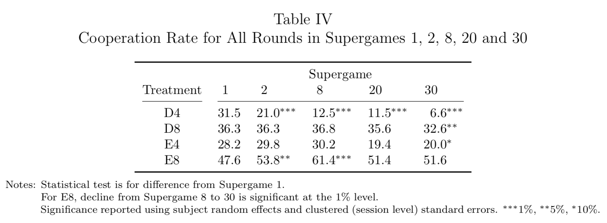

``` {r setup, echo = TRUE, message = FALSE, warning = FALSE, include = FALSE}

knitr::opts_chunk$set(fig.width = 6, fig.height = 4, fig.path = 'Figs/',
                      echo = TRUE, message = FALSE, warning = FALSE)


```

$\newcommand{\E}{\mathbb{E}} \newcommand{\Var}{\mathrm{Var}}$ 
$\newcommand{\L}{\mathscr{L}} \newcommand{\LL}{\mathscr{l}}$

# {.tabset}

### Presented by Casey O'Hara, October 3 2018

## Introduction {.tabset}


Theoretical outlook for single-shot Prisoner's Dilemma game - standard equilibrium predicts uncooperative $P,P$ outcome, Pareto-dominated by cooperative outcome.

Theoretical outlook for repeated play with a known last round also predicts uncooperative play.  Maintaining cooperation requires a credible threat of retribution/reciprocity, and if last round is known, then backward induction essentially results in an Always Defect strategy.

Some key findings:

* First round cooperation depends strongly on parameters of the repeated game
* Increasing the horizon increases initial cooperation, though through different channel than typically assumed.
    * "folk wisdom" - long horizon makes backwards induction difficult
    * new idea - long horizon increases value of early cooperation
* Subjects take time to "learn" use of threshold strategies - i.e. experience changes decisions

## Theoretical Considerations and Literature {.tabset}


## The Meta-Study {.tabset}

### Normalizing studies


Normalizing parameters in Fig. 1b: one-shot gain from defection $g$ (compared to cooperative outcome) and one-shot loss $\LL$ from being defected on (compared to non-cooperative outcome).

$$g = (T - P) / (R - P) - 1 > 0$$
$$\LL = -(S - P) / (R - P) > 0$$

### The Standard Perspective

Cooperation rates in the studies included in the metastudy tended to focus on:

* average cooperation
* cooperation in first round
* cooperation in final round
* round of first defection

Data from the included studies were revisited using a uniform methodology, referred to as _standard perspective_; these cooperation rate outcome variables were calculated for all available data.  In Table 1, note organization from short to long time horizon $H$ and high to low gain parameter $g$ within each $H$ which track well with variation in cooperation rates.  


### Horizon $\times$ experience

* Average cooperation rate always _increases_ with experience for long-horizon repeated games
* Average cooperation rate always _decreases_ with experience for short-horizon repeated games


### Value of cooperation and round one choices

Unpacking "folk wisdom" vs. proposed understanding of effect of horizon on cooperation:
Average cooperation and round to first defection increase with horizon $H$, consistent with "difficulty" of backward induction idea.  But increasing horizon also increases difference in value between joint cooperation and joint defection; more rounds means higher increase in payoff from joint cooperation, though risk remains the same (one round of "sucker" status regardless of horizon).

Defining Basin of Attraction toward "Always Defect" strategy, relative to "Grim Trigger" strategy and based on infinitely repeated PD experiments:

$$sizeBAD = \frac{\LL}{(H - 1) + \LL - g}$$
$sizeBAD \in (0, 1)$ is increasing in $g$ and $\LL$ and decreasing in $H$.  This represents the probability a player assigns to the counterpart of playing "grim" so that the player is indifferent between playing grim and AD.

As $sizeBAD \rightarrow 1$ cooperation seems less likely (the player has to have very high belief in the counterpart's probability of cooperating).


## The Experiment {.tabset}

### Procedures

Two stage-game payoffs $\times$ two horizons, played for 30 supergames:

* "Difficult" = D = high temptation payoff $T$ and low sucker payoff $S$: $(g, \LL) = (2.5, 2.83)$
* "Easy" = E = opposite $(g, \LL) = (1, 1.42)$
* Horizon 4 rounds and 8 rounds.
* $sizeBAD$(D8) = $sizeBAD$(E4) by design; if longer $H$ increases cooperation beyond the value captured in $sizeBAD$ then treatment D8 should generate more first-round cooperation than E4.

Three sessions for each treatment, though each subject experienced one set of treatment parameters (payoffs and horizon).

Payment at conclusion based on the earnings during the entire 30-supergame session.  

### Standard Perspective


-----



-----

In long-horizon treatments, cooperation in initial rounds increases with experience - cooperation in last five supergames higher than that in first five (not consistent in short-horizon treatments).

Experience leads to lower cooperation in later rounds, for all treatments - cooperation in last five supergames lower than that in first five.


### Determinants of initial cooperation

Stage-game parameters significantly affect initial cooperation and how it changes with experience.


-----

Cooperation rates for D8 and E4 are similar - suggesting that horizon effect on initial cooperation rates is largely captured within the $sizeBAD$ combined parameter (value of cooperation).  This does not support the "folk wisdom" that cooperation rates for longer horizons stem from difficulty of backward induction calculations.


## The Breakdown of Cooperation {.tabset}

### Behavior in E8 treatment

Unraveling of cooperation across supergames: behavior at the end of a supergame moves slowly in the direction suggested by backward induction.  Threshold strategy appears to evolve to have an earlier and earlier threshold.


-----

### Are players using threshold strategies?

Threshold strategy involves cooperation until one player defects; then defection for both players thereafter.  Incidence of cooperation after a defection is inconsistent with a threshold strategy, therefore a threshold strategy should show no gap between first defection and last cooperation.  

Fig. 07 shows use of threshold strategies becomes more consistent with experience.


-----

(Left) Conditional on cooperation in first round, mean round of first defection declines with experience.  (Right) Round of first defection for early, mid, and late supergames - cooperation breakdown shifts earlier by one round for every ten supergames (though probability of breakdown at start of game decreases)


### Breakdown of cooperation in other treatments

Decreasing cooperation rates start in last round, and gradually shift toward earlier rounds with experience.


-----

Consistency with threshold strategy for other treatments.


## Long-Run Behavior  {.tabset}

### Learning model

1. cooperation rates in the first round of a supergame are decreasing in the size of the basin of attraction of AD.
2. choices respond to experiences with other players in previous supergames.
3. a majority of subjects converge to using threshold strategies.

#### Strategies considered

* All threshold-type strategies (threshold-$m$ where $m \in [1, H]$?)
* Tit-for-tat (cooperates move 1, follows opponent's prior move after)
* Suspicious tit-for-tat (same as TFT but defects on move 1)

#### Beliefs

$$\beta_{it + 1} = \theta_i \beta_{it} + L_{it}$$
where $\beta^k_{it}$ is weight that subj $i$ places on strategy $k$ to be adopted by opponent in supergame $t$. $\theta_i$ is discounting of past nbeliefs, $L_{it}$ is update vector given play in supergame $t$.  $L^k_{it}$ takes value 1 when a unique strategy most consistent with opponent's play within a supergame; for all other strategies, update vector takes value 0.

#### Utility

$$\vec{\mu}_{it} = \vec{u}_{it} + \lambda_i \vec{\epsilon}_{it}$$
where $\vec{u}_{it} = \vec{U}\beta_{it}$ and $\vec{U}$ is a square matrix representing payoff comparing each strategy against every other strategy (function of $H$ and stage-game payoffs).  $\lambda_i$ is scaling parameter measuring how well subject responds to beliefs, $\epsilon_{it}$ is vector of idiosyncratic error terms.

#### Strategy model based on learning

Probability of choosing strategy $k$:

$$p^k_{it} = \frac{\exp (\frac{u^k_{it}}{\lambda_i})}{\sum_k \exp(\frac{u^k_{it}}{\lambda_i})}$$

#### Parameterizing the model

For each subject, they estimated (using MLE) $\beta_{i0}, \lambda_i, \sigma_i$ (initial beliefs, noise in strategy, noise in action choice implementation), and $\theta_i, \kappa_i$ (how beliefs are updated, and how execution noise changes over time).

### Simulations


### Counterfactuals

Which factors contribute to the sustained cooperation seen in long-run behavior in figure XI?

#### Cooperative types?

What if a small fraction of cooperative subjects sustains long-term cooperation?  

* See appendix A.5, where all subject results are compared to results with most cooperative subjects removed.
* Suggests cooperative types can slow unraveling to a limited extent.

#### Effect of stage-game payoffs on strategy choice?

* Using individual-level parameter estimates for learning model from E8 subjects, and simulate how these individuals would play D8 game.


## Discussion

Key Findings:

* Parameters of supergame, particularly horizon, have significant impact on initial cooperation.
* Longer horizon increases initial cooperation because it increases value of using conditionally cooperative strategies, rather than difficulty of backward induction.
* Value of using cooperative strategies can be captured by $sizeBAD$: temptation of being the first to defect vs. cost of defecting too early.
* Threshold strategies always emerge over time.
* Unraveling of cooperation is evident in all treatments, but cooperation could stabilize at positive levels with further experience.  Slow unraveling may be facilitated by a small proportion of cooperative types, with 
